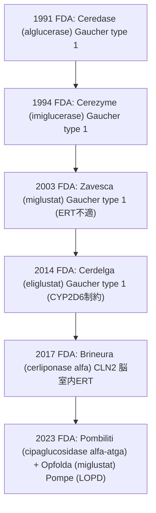

> **更新方針**：新承認・適応拡大があれば追記します。一次情報（FDA/EMA/PMDAのラベル・EPAR 等）を参照しています。

## 概要
リソソームは細胞内の主に不用物の分解を担うオルガネラです。リソソームには約60種類以上の分解酵素があると言われており、それらの酵素の遺伝子変異や、その他リソソーム機能維持に重要なタンパク質の欠損は重篤な病態を引き起こすことがあります。この記事では、リソソーム関連疾患に対する承認薬を、作用形式（ERT/SRT/薬理シャペロン/遺伝子治療）で整理し、初回承認年の時系列順で俯瞰することができます。
ERT（Enzyme Replacement Therapy）とは欠損/機能低下しているリソソーム酵素を、外因性に補充する治療であり、SRT（Substrate Reduction Therapy）とは 分解できない基質（substrate）の産生を抑えて、リソソームへの負荷を下げる治療です。
ERTは末梢病変に対する標準治療として発展してきた一方、中枢移行性の制約を背景に、SRTやシャペロン、投与経路の工夫（脳室内投与など）、遺伝子治療へとモダリティが拡張しています。

## 承認済みリソソーム標的薬（主要）
初回承認の年の順番に並べています。最終更新日時点での情報を元にまとめています。個別症例の適用可否は各国の承認条件・年齢制限等をご確認ください。

| 疾患/適応 | 販売名［一般名］ | 作用形式 | 会社 | 初回承認（地域） | 投与 | メモ |
|---|---|---|---|---|---|---|
| Gaucher病1型 | イミグルセラーゼ［Cerezyme］ | ERT | Sanofi Genzyme | 1994（米）[^1] | 点滴 | 初の標準ERT |
| Cystinosis | **システアミン**［Cystagon/Procysbi］ | **シスチン低下** | Mylan/Horizon | 1994（米：IR）[^2] | 経口 | 徐放（DR）は2013（米）[^3] |
| Fabry病（EU） | アガルシダーゼα［Replagal］ | ERT | Takeda | 2001（EU）[^4] | 点滴 | 米国は未承認 |
| Fabry病 | アガルシダーゼβ［Fabrazyme］ | ERT | Sanofi Genzyme | 2003（米）[^5] | 点滴 | 主要ERT |
| MPS I | ラロニダーゼ［Aldurazyme］ | ERT | BioMarin/Genzyme | 2003（米/EU）[^6] | 点滴 | 標準治療 |
| Gaucher病1型（ERT不適） | ミグルスタット［Zavesca］ | **SRT** | Actelion→Janssen | 2003（米）[^7] | 経口 | 代替療法（EUではNPCにも適応） |
| MPS VI | ガルスルファーゼ［Naglazyme］ | ERT | BioMarin | 2005（米）[^8] | 点滴 | 歩行・階段昇降改善 |
| Pompe病 | アルグルコシダーゼα［Myozyme/Lumizyme］ | ERT | Sanofi | 2006（EU/米）[^9] | 点滴 | 乳児/遅発型の中核治療 |
| MPS II（ハンター） | イドルスルファーゼ［Elaprase］ | ERT | Takeda | 2006（米）[^10] | 点滴 | 週1回投与 |
| NPC（Niemann–Pick C） | **ミグルスタット**［Zavesca］ | **SRT** | Advanz等 | 2009（EU）[^11] | 経口 | 進行性神経症状にEU適応 |
| Gaucher病1型 | ベラグルセラーゼα［VPRIV］ | ERT | Shire→Takeda | 2010（米）[^12] | 点滴 | Cerezyme代替 |
| Gaucher病1型 | タリグルセラーゼα［Elelyso］ | ERT | Protalix/Pfizer | 2012（米）[^13] | 点滴 | 植物細胞由来 |
| Gaucher病1型 | エリグルスタット［Cerdelga］ | **SRT** | Sanofi Genzyme | 2014（米）[^14] | 経口 | GCS阻害。CYP2D6で用量調整 |
| MPS IVA（モルキオA） | エロスルファーゼα［Vimizim］ | ERT | BioMarin | 2014（米）[^15] | 点滴 | 初のMPS IVA治療 |
| LAL欠損症 | セベリパーゼα［Kanuma］ | ERT | Alexion | 2015（米/EU）[^16] | 点滴 | LAL-Dに対する初の治療 |
| Fabry病 | **ミガラスタット**［Galafold］ | **薬理シャペロン** | Amicus | 2016（EU）[^17] | 経口 | 変異“amenable”例に限定 |
| MPS VII（Sly） | ベストロニニダーゼα［Mepsevii］ | ERT | Ultragenyx | 2017（米）[^18] | 点滴 | 超希少疾患 |
| CLN2（バッテン病） | セルリポナーゼα［Brineura］ | **脳室内ERT** | BioMarin | 2017（米/EU）[^19] | 脳室内 | 中枢投与 |
| α-マンノシドーシス | ベルマナーゼα［Lamzede］ | ERT | Chiesi | 2018（EU）[^20] | 点滴 | 2023に米国承認[^21] |
| 異染性白質ジストロフィー(MLD) | **atidarsagene autotemcel**［Libmeldy］ | **遺伝子治療**（自家HSC） | Orchard | 2020（EU）[^22] | 移植 | 米国未承認 |
| Pompe病（遅発型） | アバルグルコシダーゼα［Nexviazyme］ | ERT | Sanofi | 2021（米/EU）[^23] | 点滴 | LOPD適応 |
| ASMD（Niemann–Pick A/B） | オリプダーゼα［Xenpozyme］ | ERT | Sanofi | 2022（JP→EU/米）[^24] | 点滴 | 非中枢症状に適応 |
| Fabry病 | ペグニガルシダーゼα［Elfabrio］ | ERT | Protalix/Chiesi | 2023（米/EU）[^25] | 点滴 | 新規ERT |
| Pompe病（成人） | シパグルコシダーゼα＋ミグルスタット［Pombiliti+Opfolda］ | 強化ERT＋シャペロン | Amicus | 2023（米/EU）[^26] | 点滴＋経口 | 2剤併用の新機序 |

[^1]: FDA Orphan Drug Designations and Approvals: Cerezyme (imiglucerase) — Marketing Approval Date 05/23/1994.  [oai_citation:0‡FDA Access Data](https://www.accessdata.fda.gov/scripts/opdlisting/oopd/detailedIndex.cfm?cfgridkey=62491)
[^2]: FDA Orphan Drug Designations and Approvals: Cystagon (cysteamine) — Marketing Approval Date 08/15/1994.  [oai_citation:1‡FDA Access Data](https://www.accessdata.fda.gov/scripts/opdlisting/oopd/detailedIndex.cfm?cfgridkey=55690)
[^3]: FDA Summary Review (Procysbi NDA 203389): approval 04/03/2013; references listed drug Cystagon (approved in 1994).  [oai_citation:2‡FDA Access Data](https://www.accessdata.fda.gov/drugsatfda_docs/nda/2020/213491Orig1s000SumR.pdf)
[^4]: EMA EPAR: Replagal — EU marketing authorisation granted 3 Aug 2001.  [oai_citation:3‡European Medicines Agency (EMA)](https://www.ema.europa.eu/en/medicines/human/EPAR/replagal)
[^5]: FDA Orphan Drug Designations and Approvals: Fabrazyme (agalsidase beta) — Marketing Approval Date 04/24/2003.  [oai_citation:4‡FDA Access Data](https://www.accessdata.fda.gov/scripts/opdlisting/oopd/detailedIndex.cfm?cfgridkey=15286)
[^6]: FDA Orphan Drug Designations and Approvals: Aldurazyme (laronidase) — Marketing Approval Date 04/30/2003.  [oai_citation:5‡FDA Access Data](https://www.accessdata.fda.gov/scripts/opdlisting/oopd/detailedIndex.cfm?cfgridkey=106097)
[^7]: FDA Orphan Drug Designations and Approvals: Zavesca (miglustat) — Marketing Approval Date 07/31/2003.  [oai_citation:6‡FDA Access Data](https://www.accessdata.fda.gov/scripts/opdlisting/oopd/detailedIndex.cfm?cfgridkey=112598)
[^8]: FDA Orphan Drug Designations and Approvals: Naglazyme (galsulfase) — Marketing Approval Date (see FDA OPD listing).  [oai_citation:7‡FDA Access Data](https://www.accessdata.fda.gov/scripts/opdlisting/oopd/detailedIndex.cfm?cfgridkey=119898)
[^9]: FDA Orphan Drug Designations and Approvals: Myozyme (alglucosidase alfa) — Marketing Approval Date (FDA OPD listing). 
[^10]: FDA Orphan Drug Designations and Approvals: Elaprase (idursulfase) — Marketing Approval Date (FDA OPD listing). 
[^11]: EMA EPAR: Zavesca — indication/authorisation information for Niemann–Pick type C.  [oai_citation:8‡European Medicines Agency (EMA)](https://www.ema.europa.eu/en/medicines/human/EPAR/libmeldy)
[^12]: FDA Orphan Drug Designations and Approvals: VPRIV (velaglucerase alfa) — Marketing Approval Date (FDA OPD listing). 
[^13]: FDA Orphan Drug Designations and Approvals: Elelyso (taliglucerase alfa) — Marketing Approval Date (FDA OPD listing).  [oai_citation:9‡FDA Access Data](https://www.accessdata.fda.gov/scripts/opdlisting/oopd/detailedIndex.cfm?cfgridkey=391913)
[^14]: FDA Orphan Drug Designations and Approvals: Cerdelga (eliglustat) — Marketing Approval Date (FDA OPD listing).  [oai_citation:10‡FDA Access Data](https://www.accessdata.fda.gov/scripts/opdlisting/oopd/detailedIndex.cfm?cfgridkey=265408)
[^15]: FDA Orphan Drug Designations and Approvals: Vimizim (elosulfase alfa) — Marketing Approval Date (FDA OPD listing).  [oai_citation:11‡FDA Access Data](https://www.accessdata.fda.gov/scripts/opdlisting/oopd/detailedIndex.cfm?cfgridkey=411913)
[^16]: FDA approval letter: Kanuma (sebelipase alfa) — approved effective Dec 8, 2015.  [oai_citation:12‡FDA Access Data](https://www.accessdata.fda.gov/drugsatfda_docs/appletter/2015/125561Orig1s000ltr.pdf)
[^17]: EMA EPAR: Galafold (migalastat) — EU marketing authorisation/overview.  [oai_citation:13‡FDA Access Data](https://www.accessdata.fda.gov/scripts/opdlisting/oopd/detailedIndex.cfm?cfgridkey=106097)
[^18]: Ultragenyx press release: FDA approval of Mepsevii (vestronidase alfa) on Nov 15, 2017.  [oai_citation:14‡Ultragenyx](https://ir.ultragenyx.com/news-releases/news-release-details/ultragenyx-announces-fda-approval-mepseviitm-vestronidase-alfa)
[^19]: FDA approval document for Brineura (cerliponase alfa), dated Apr 27, 2017.  [oai_citation:15‡FDA Access Data](https://www.accessdata.fda.gov/drugsatfda_docs/nda/2017/761052Orig1s000Approv.pdf)
[^20]: EMA EPAR: Lamzede (velmanase alfa) — EU marketing authorisation/overview.  [oai_citation:16‡FDA Access Data](https://www.accessdata.fda.gov/scripts/opdlisting/oopd/detailedIndex.cfm?cfgridkey=601617)
[^21]: FDA Orphan Drug Designations and Approvals: Lamzede (velmanase alfa) — US marketing approval (FDA OPD listing).  [oai_citation:17‡FDA Access Data](https://www.accessdata.fda.gov/scripts/opdlisting/oopd/detailedIndex.cfm?cfgridkey=212005)
[^22]: EMA EPAR: Libmeldy — EU marketing authorisation valid throughout EU on 17 Dec 2020.  [oai_citation:18‡European Medicines Agency (EMA)](https://www.ema.europa.eu/en/medicines/human/EPAR/libmeldy)
[^23]: FDA Orphan Drug Designations and Approvals: Nexviazyme (avalglucosidase alfa) — Marketing Approval Date (FDA OPD listing).  [oai_citation:19‡FDA Access Data](https://www.accessdata.fda.gov/scripts/opdlisting/oopd/detailedIndex.cfm?cfgridkey=411913)
[^24]: FDA Orphan Drug Designations and Approvals: Xenpozyme (olipudase alfa-rpcp) — Marketing Approval Date 08/31/2022; Japan first approval mentioned by Sanofi (Mar 2022).  [oai_citation:20‡FDA Access Data](https://www.accessdata.fda.gov/scripts/opdlisting/oopd/detailedIndex.cfm?cfgridkey=132900)
[^25]: FDA approval letter: Elfabrio (pegunigalsidase alfa-iwxj) — approved effective May 9, 2023.  [oai_citation:21‡FDA Access Data](https://www.accessdata.fda.gov/drugsatfda_docs/appletter/2023/761161Orig1s000ltr.pdf)
[^26]: FDA Orphan Drug Designations and Approvals: Pombiliti and Opfolda (cipaglucosidase alfa-atga and miglustat) — Marketing Approval Date 09/28/2023.  [oai_citation:22‡FDA Access Data](https://www.accessdata.fda.gov/scripts/opdlisting/oopd/detailedIndex.cfm?cfgridkey=601617)

## 対象疾患について
上記のリソソーム標的薬の対象疾患は、リソソームの機能破綻を背景にします。内訳としては、リソソーム加水分解酵素（lysosomal hydrolase）の欠損に起因するLysosomal Storage Diseases（LSD）が中心ですが、酵素欠損ではない疾患も一部含まれます。

### リソソーム加水分解酵素欠損による典型的なLSD（Lysosomal Storage Diseases）
- Gaucher病（GBA1 / β-glucocerebrosidase）
- Fabry病（GLA / α-galactosidase A）
- Pompe病（GAA / acid α-glucosidase）
- MPS I/II/IVA/VI/VII（IDUA / IDS / GALNS / ARSB / GUSB）
- LAL欠損症（LAL-D）（LIPA / lysosomal acid lipase）
- CLN2（TPP1 / tripeptidyl peptidase 1）
- ASMD（Niemann–Pick A/B）（SMPD1 / acid sphingomyelinase）
- α-マンノシドーシス（MAN2B1 / lysosomal α-mannosidase）
- MLD（ARSA / arylsulfatase A）

### （表内の例外）加水分解酵素欠損ではない lysosome-related disorders
- NPC（Niemann–Pick C）：主にNPC1/NPC2（脂質輸送・トラフィッキング異常）で、加水分解酵素欠損ではない
- Cystinosis：CTNS（cystinosin：リソソーム膜輸送体）欠損で、加水分解酵素欠損ではない

## モダリティ（治療アプローチ）

本記事で扱う「リソソーム標的薬」は、主に <strong>(i) 欠損酵素を補う</strong>、<strong>(ii) 蓄積基質の産生を抑える</strong>、<strong>(iii) 変異酵素のフォールディング/輸送を助ける</strong>、<strong>(iv) 遺伝子を導入して持続的に酵素活性を回復する</strong>、の4系統に整理できます。

### ERT（Enzyme Replacement Therapy；酵素補充療法）
定義：欠損または機能低下したリソソーム加水分解酵素を、<strong>組換えタンパク質（recombinant enzyme）として外因性に補充</strong>する治療です。多くは <strong>静脈内投与（IV infusion）を反復</strong>して行います。[^27]

<strong>細胞内取り込みとリソソーム送達の要点</strong>：ERT製剤は、末梢組織で <strong>受容体介在性エンドサイトーシス（receptor-mediated endocytosis）</strong>により細胞内へ取り込まれ、エンドソーム—リソソーム経路で標的区画へ送達されます。一般に <strong>mannose-6-phosphate receptor（M6PR）経路</strong>が基盤概念として重要であり、糖鎖設計（glyco-engineering）が有効性に直結しえます。[^28] 一方、<strong>Gaucher病のβ-glucocerebrosidase（imiglucerase など）では、標的細胞であるマクロファージのendocytic carbohydrate receptor（mannose receptor）に認識される “mannose-terminated” 糖鎖が実装上の設計勘所</strong>として明示されています。[^29]

<strong>限界</strong>  
- <strong>BBB（blood–brain barrier；血液脳関門）/CNS（central nervous system；中枢神経）移行の制約</strong>：
  一般に全身投与のERTはBBBを通過しにくく、<strong>中枢症状（CNS manifestations）には効果が限定的</strong>になりやすい。[^27]  
- <strong>免疫原性と投与負担</strong>：
  反復IV投与に伴う <strong>注入反応(infusion-associated reactions)</strong>、過敏反応、抗薬物抗体（anti-drug antibodies）などが課題です（詳細は各製品ラベル参照）。[^30]

<strong>例外</strong>：<strong>Brineura（cerliponase alfa）</strong>は、CLN2（TPP1欠損）に対して <strong>脳室内投与（intraventricular infusion）</strong>を採用し、CNSへ直接投与する設計がラベルに示されています。[^30]

---

### SRT（Substrate Reduction Therapy；基質生成抑制療法）
定義：分解できずに蓄積する基質（substrate）の <strong>産生側</strong>を抑えることで、リソソームへの負荷を低下させる治療です。<strong>経口投与（oral）</strong>の選択肢になり得ます。[^31]

<strong>Gaucher病での代表例（本記事の表に掲載）</strong>  
- <strong>miglustat（Zavesca）</strong>：
  成人の Gaucher病 type 1 において、<strong>ERTが治療選択肢にならない</strong>患者を対象に <strong>単剤（monotherapy）</strong>として適応が規定されています。[^31]  
- <strong>eliglustat（Cerdelga）</strong>：
  <strong>glucosylceramide synthase（GCS）阻害</strong>によるSRTです。適格性/投与設計に <strong>CYP2D6（薬物代謝酵素）表現型</strong>が組み込まれており、<strong>CYP2D6 超高速代謝型では十分濃度が得られない可能性</strong>、また <strong>中間代謝型では用量推奨が困難</strong>であること等が表記されています（= 個別化投与設計 の典型例）。[^32][^33]

---

### 薬理シャペロン（Pharmacological chaperone）
定義：特定の変異で不安定化/ミスフォールディングしたリソソーム酵素に結合し、<strong>立体構造の安定化（stabilization）とリソソームへのトラフィッキング回復</strong>を介して残存活性を引き出すアプローチです。

<strong>例：Fabry病</strong>：<strong>migalastat（Galafold）</strong>は、<strong>in vitro試験で感受性が確認されたGLA遺伝子変異（アメナブル変異）を有する患者に限定して、適応が認められています。[^34][^35]

---

### 遺伝子治療（Gene therapy）
定義：遺伝子導入により、標的タンパク質（多くは欠損酵素）の産生を回復させ、<strong>長期的な酵素活性の再建</strong>を狙った治療です。

<strong>例：異染性白質ジストロフィー(MLD)</strong>：<strong>atidarsagene autotemcel（Libmeldy）</strong>は、自家造血幹細胞（autologous CD34+ HSC）に対し ex vivo で遺伝子導入を行う細胞遺伝子治療薬として、欧州で製造販売承認を取得しています。本治療においては、発症・進行前の適切な投与タイミングの設定と、長期的な経過観察（フォローアップ）が極めて重要となります。[^36][^37]

---

## モダリティ開発のマイルストーン

1. <strong>1991：Ceredase（alglucerase）</strong> — Gaucher病 type 1 で <strong>placenta由来</strong>の初期ERTがFDAで承認（のちにrecombinantへ置換）。[^38]  
2. <strong>1994：Cerezyme（imiglucerase）</strong> — Gaucher病 type 1 で <strong>recombinant ERT</strong>がFDAで初回承認（以後の標準ERTの基盤）。[^39][^29]  
3. <strong>2003：Zavesca（miglustat）</strong> — Gaucher病 type 1 に <strong>経口SRT</strong>が臨床導入（ERT不適例を想定）。[^31]  
4. <strong>2014：Cerdelga（eliglustat）</strong> — <strong>CYP2D6表現型に基づく適格性/投与設計</strong>を伴うSRTがFDAで承認。[^32]  
5. <strong>2017：Brineura（cerliponase alfa）</strong> — <strong>脳室内ERT</strong>としてCNSへ直接投与する設計がFDAで承認。[^30]  
6. <strong>2023：Pombiliti（cipaglucosidase alfa-atga）＋ Opfolda（miglustat）</strong> — Pompe病（LOPD）で <strong>ERT＋併用シャペロン</strong>という“複合モダリティ”がFDAで承認。[^40][^41]

[^27]: FDA. Eliglustat (Cerdelga) NDA Summary Review（「ERTはBBBを通過しないためCNSには限界」等の記載を含む）. [oai_citation:27‡FDA Access Data](https://www.accessdata.fda.gov/drugsatfda_docs/nda/2012/022458Orig1s000SumR.pdf)
[^28]: Ellison S, et al. Advances in therapies for neurological lysosomal storage disorders. J Inherit Metab Dis (2023).（ERTの受容体介在性エンドサイトーシスとM6PR経路の概説）[oai_citation:28‡Wiley Online Library](https://onlinelibrary.wiley.com/doi/full/10.1002/jimd.12615)
[^29]: FDA. Cerezyme (imiglucerase) label（mannose-terminated糖鎖がmacrophageのendocytic carbohydrate receptorに認識される旨）. [oai_citation:29‡FDA Access Data](https://www.accessdata.fda.gov/drugsatfda_docs/label/2002/20367s53lbl.pdf)
[^30]: FDA. Brineura (cerliponase alfa) label（intraventricular route 等）. [oai_citation:30‡FDA Access Data](https://www.accessdata.fda.gov/drugsatfda_docs/label/2017/761052lbl.pdf)
[^31]: FDA. Zavesca (miglustat) label（GD1でERT不適例のmonotherapy等）. [oai_citation:31‡FDA Access Data](https://www.accessdata.fda.gov/drugsatfda_docs/label/2020/021348s016lbl.pdf)
[^32]: FDA. Drug Approval Package: Cerdelga (eliglustat) – Approval Date 8/19/2014. [oai_citation:32‡FDA Access Data](https://www.accessdata.fda.gov/drugsatfda_docs/nda/2014/205494Orig1s000TOC.cfm)
[^33]: FDA. Cerdelga (eliglustat) label（CYP2D6 ultra-rapid / indeterminate 等の制約）. [oai_citation:33‡FDA Access Data](https://www.accessdata.fda.gov/drugsatfda_docs/label/2014/205494orig1s000lbl.pdf)
[^34]: FDA. Galafold (migalastat) label（amenable GLA variant を適応条件として明示）. [oai_citation:34‡FDA Access Data](https://www.accessdata.fda.gov/drugsatfda_docs/label/2024/208623s008lbl.pdf)
[^35]: EMA. Galafold EPAR（EUでの承認と“amenable mutation”要件の概説）. [oai_citation:35‡European Medicines Agency](https://www.ema.europa.eu/en/medicines/human/EPAR/galafold)
[^36]: EMA. Libmeldy EPAR（EUでのマーケティングオーソリゼーション日：17 Dec 2020）. [oai_citation:36‡European Medicines Agency](https://www.ema.europa.eu/en/medicines/human/EPAR/libmeldy)
[^37]: EMA. Libmeldy EPAR product information（治療内容：autologous CD34+ HSC, ex vivo gene transfer 等）. [oai_citation:37‡European Medicines Agency](https://www.ema.europa.eu/en/documents/product-information/libmeldy-epar-product-information_en.pdf)
[^38]: FDA Orphan Drug Designations and Approvals: Ceredase (alglucerase) — Marketing Approval Date 04/05/1991. [oai_citation:38‡FDA Access Data](https://www.accessdata.fda.gov/scripts/opdlisting/oopd/detailedIndex.cfm?cfgridkey=5585)
[^39]: FDA Purple Book: CEREZYME (imiglucerase) BLA 020367 — Original Approval Date May 23, 1994. [oai_citation:39‡FDA Purple Book](https://purplebooksearch.fda.gov/productdetails?query=020367)
[^40]: FDA. Pombiliti (cipaglucosidase alfa-atga) label（Initial U.S. Approval: 2023）. [oai_citation:40‡FDA Access Data](https://www.accessdata.fda.gov/drugsatfda_docs/label/2023/761204s000lbl.pdf)
[^41]: FDA. Opfolda (miglustat) label（Pombilitiとの併用等；Initial U.S. Approval: 2023）. [oai_citation:41‡FDA Access Data](https://www.accessdata.fda.gov/drugsatfda_docs/label/2023/215211s000lbl.pdf)

## 出典
一次情報：FDA（Drugs@FDA / ラベル）、EMA（EPAR）、PMDA（承認審査資料・添付文書）ほか。
