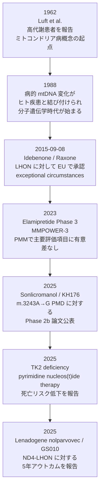

> **対象オルガネラ**: Mitochondria / **主なモダリティ**: 支持療法、低分子、ペプチド、遺伝子治療、生殖医療 / **主な適応**: Primary mitochondrial disease

## ミトコンドリア病とは？

<strong>ミトコンドリア</strong>は、細胞内で<strong>酸化的リン酸化（oxidative phosphorylation; OXPHOS）</strong>を担い、ATP産生の中核となるオルガネラです。原発性ミトコンドリア病（<strong>primary mitochondrial disease; PMD</strong>）は、このミトコンドリア呼吸鎖やその維持機構の障害によって生じる、遺伝学的・臨床的にきわめて多様な疾患群です。[^1][^2]

ミトコンドリア機能が低下すると、特に<strong>好気的代謝への依存度が高い組織</strong>が障害されやすくなります。具体的には、<strong>脳、骨格筋、心筋、視神経、肝臓、腎臓、内分泌系</strong>などが影響を受けやすく、ミトコンドリア病がしばしば<strong>多臓器性（multisystem）</strong>の表現型を示す理由の一つになっています。[^1][^2]

### 原発性ミトコンドリア病と二次性ミトコンドリア病

ミトコンドリア障害は大きく、<strong>原発性ミトコンドリア病</strong>と<strong>二次性ミトコンドリア障害</strong>に分けられます。[^1]

- <strong>原発性ミトコンドリア病（primary mitochondrial disease）</strong>  
  ミトコンドリア機能そのものが病因の中心であり、<strong>mtDNA</strong>または<strong>核DNA（nDNA）</strong>の病的バリアントによって、呼吸鎖、mtDNA維持、ミトコンドリア翻訳、ダイナミクスなどが障害される疾患群です。[^1][^3]

- <strong>二次性ミトコンドリア障害（secondary mitochondrial dysfunction）</strong>  
  一次原因は別に存在し、その結果としてミトコンドリア機能低下が生じる状態です。たとえば、他の遺伝性疾患、代謝疾患、神経変性疾患、炎症、薬剤性障害などでもミトコンドリア異常は二次的にみられます。[^1]

本記事では、主として<strong>原発性ミトコンドリア病(PMD)</strong>を扱います。

<!-- 用語解説：ヘテロプラスミー -->

  

    
      <strong>用語解説：ヘテロプラスミー（heteroplasmy）</strong>
      詳しく見る ▼
    
  

  

    

      <strong>ヘテロプラスミー（heteroplasmy）</strong>とは、1つの細胞内に存在する多数の<strong>ミトコンドリアDNA（mtDNA）コピー</strong>がすべて同一ではなく、<strong>正常型（wild-type）</strong>と<strong>変異型（mutant）</strong>が混在している状態を指します。[^4][^5]
    

    

      mtDNAは1細胞あたり多数コピー存在しており、そのコピー数は組織によって異なります。変異型mtDNAの割合、すなわち<strong>heteroplasmy level</strong>は、細胞機能低下や臨床表現型の出現に強く影響します。[^4][^5]
    

    
研究・診断上の重要性

    

      研究・診断の観点から重要なのは、ヘテロプラスミーが一様ではないことです。[^4][^6]
    

    <ul style="margin:0.2rem 0 0 1.2rem;">
      <li style="margin-bottom:0.4rem;">
        <strong>組織差（tissue heterogeneity）</strong>：同じ個体でも、血液では変異率が低く、骨格筋や脳などで高いことがあります。したがって、血液検査だけでは病的mtDNA変異を十分に評価できない場合があります。[^1][^4][^6]
      </li>
      <li style="margin-bottom:0.4rem;">
        <strong>細胞間ばらつき（cell-to-cell variance）</strong>：同一組織内でも細胞ごとに変異率が異なりうるため、組織全体の平均値だけでは病態を完全には表せません。[^4][^5]
      </li>
      <li>
        <strong>時間変化</strong>：ヘテロプラスミーは固定的ではなく、細胞増殖、組織更新、選択圧などにより経時的に変化しえます。特に血液系では年齢や細胞動態に伴う変動が問題になります。[^4][^5]
      </li>
    </ul>
  

<!-- 用語解説：閾値効果 -->

  

    
      <strong>用語解説：閾値効果（threshold effect）</strong>
      詳しく見る ▼
    
  

  

    

      <strong>閾値効果（threshold effect）</strong>とは、変異mtDNAが存在していても、ある一定割合までは細胞機能が代償され、<strong>変異負荷がある閾値を超えたときに初めて機能障害や症状が顕在化する</strong>という概念です。[^5][^7]
    

    

      この閾値は固定ではなく、<strong>変異の種類</strong>、<strong>組織のエネルギー需要</strong>、<strong>mtDNA copy number</strong>、<strong>代謝状態</strong>などに依存します。そのため、同じ変異を有していても、患者間あるいは組織間で症状の強さが大きく異なることがあります。[^1][^5][^7]
    

  

---

## 発見の経緯

ミトコンドリア病という疾患概念の起点として古典的に引用されるのが、<strong>1962年の Roland Luft らの報告</strong>です。Luftらは、甲状腺機能亢進症では説明できない著明な高代謝状態を示す患者を解析し、<strong>骨格筋ミトコンドリアの呼吸調節異常</strong>を報告しました。[^8]

この症例は後に<strong>Luft disease</strong>として知られるようになり、しばしば「最初に記載されたミトコンドリア病」と位置づけられます。[^2][^9]

<!-- 用語解説：脱共役（loose coupling） -->

  

    
      <strong>用語解説：脱共役（loose coupling）</strong>
      詳しく見る ▼
    
  

  

    

      通常、ミトコンドリアでは電子伝達系によって形成されたプロトン駆動力が<strong>ATP synthase</strong>によるATP産生に結びついており、この状態を<strong>coupling</strong>と呼びます。
      <a href="#fn:8" class="footnote">8</a><a href="#fn:9" class="footnote">9</a>
    

    

      これに対して<strong>脱共役（uncoupling, loose coupling）</strong>とは、電子伝達による酸素消費は進む一方で、そのエネルギーがATP合成に十分使われず、<strong>熱として散逸しやすい状態</strong>を指します。Luftらの症例では、骨格筋ミトコンドリアでこのような<strong>oxidative phosphorylationの結合効率低下</strong>が示され、ミトコンドリア異常がヒト疾患の原因となりうることを初めて強く印象づけました。
      <a href="#fn:8" class="footnote">8</a><a href="#fn:9" class="footnote">9</a>
    

  

---

## 原因

<strong>原発性ミトコンドリア病（primary mitochondrial disease; PMD）</strong>は、<strong>mtDNA</strong>または<strong>核DNA（nDNA）</strong>に存在する病的バリアントによって、ミトコンドリアのエネルギー産生や恒常性維持が障害されて生じる疾患群です。近年のレビューでは、PMDの原因として<strong>400を超える遺伝子</strong>が関与すると整理されており、その大半はnDNA上に存在します。[^10][^11]

ミトコンドリアの主要な役割は<strong>酸化的リン酸化（oxidative phosphorylation; OXPHOS）</strong>によるATP産生であり、PMDの中心病態もこのOXPHOS障害にあります。[^1][^2]  
一方で、原因は呼吸鎖そのものに限られず、mtDNA複製・維持、ミトコンドリア翻訳、膜構造、融合・分裂、代謝物輸送など、さまざまな過程の破綻が含まれます。[^1][^10]

### 特に寄与が大きい分子・機能カテゴリ

- <strong>OXPHOS複合体（Complex I–V）関連遺伝子</strong>  
  呼吸鎖複合体の構造サブユニットまたは組み立て因子の異常は、PMDの中核です。特に<strong>Complex I</strong>は構成因子が多く、疾患原因として頻繁にみられます。mtDNA上では<strong>MT-ND1, MT-ND4, MT-ND6</strong>など、nDNA上では<strong>NDUFS</strong>群、<strong>NDUFAF</strong>群などが代表例です。[^1][^2][^10]

- <strong>mtDNA維持・複製関連遺伝子</strong>  
  <strong>POLG, TWNK, TFAM, MPV17, TK2</strong> などの異常では、mtDNA depletionやmultiple deletionsが生じ、筋・神経・肝などに障害をきたします。[^1][^2]

- <strong>ミトコンドリア翻訳関連遺伝子</strong>  
  mtDNAは13個の呼吸鎖タンパク質をコードしますが、その翻訳にはミトコンドリアtRNA、rRNA、および多数の核コード因子が必要です。したがって、<strong>MT-TL1</strong>などのmt-tRNA変異や、アミノアシルtRNA synthetase、翻訳補助因子の異常も重要です。[^1][^2][^10]

- <strong>ミトコンドリアダイナミクス・膜構造関連遺伝子</strong>  
  <strong>OPA1, MFN2, DNM1L</strong> などは、ミトコンドリアの融合・分裂や内膜構造の維持に関与し、神経・筋・視神経を中心とした病態を生じます。[^1][^10]

- <strong>代謝物輸送・補酵素関連遺伝子</strong>  
  pyruvate代謝、脂肪酸酸化、Coenzyme Q10生合成、鉄硫黄クラスター形成などもPMDに含まれ、狭義の「呼吸鎖病」だけでは捉えきれません。[^1][^2]

### mtDNAとnDNAの二重支配

ミトコンドリア病の診断や研究を複雑にしている大きな理由の一つは、ミトコンドリア機能が<strong>mtDNAとnDNAの二重支配</strong>を受けていることです。mtDNAは37遺伝子しか持ちませんが、ミトコンドリア局在タンパク質全体は核ゲノムに強く依存しており、ミトコンドリア・プロテオームに関連するヒト遺伝子は1000以上、そのうち<strong>400以上の遺伝子</strong>がPMDと関連すると報告されています。[^10][^12]

---

## 症状

PMDの症状はきわめて多彩ですが、共通する特徴は、<strong>エネルギー需要の高い組織が障害されやすい</strong>ことです。したがって、<strong>脳・骨格筋・心筋・視神経・聴覚系・内分泌系</strong>などに症状が出やすく、単一臓器ではなく<strong>多臓器性（multisystem）</strong>の表現型をとることが多いです。[^1][^2]

代表的には以下のような症状がみられます。[^1][^2][^13]

- <strong>神経系</strong>：発達遅滞、てんかん、運動失調、認知機能障害、stroke-like episode、末梢神経障害
- <strong>筋</strong>：易疲労性、筋力低下、運動不耐、筋痛、慢性進行性外眼筋麻痺（CPEO）
- <strong>視覚</strong>：視力低下、視神経症（例：LHON）、網膜病変
- <strong>聴覚</strong>：感音難聴
- <strong>心臓</strong>：心筋症、伝導障害、不整脈
- <strong>内分泌・代謝</strong>：糖尿病、低身長、乳酸アシドーシス
- <strong>消化器・肝・腎</strong>：便秘や消化管運動障害、肝障害、腎尿細管障害
- <strong>全身症状</strong>：低体重、全身倦怠感、発育障害

同じ遺伝子変異であっても症状の出方は大きく異なり、年齢によっても表現型は変化します。これは、<strong>ヘテロプラスミー</strong>、<strong>閾値効果</strong>、組織ごとの代謝要求、核ゲノム背景などが複雑に影響するためです。[^1][^2]

---

## 発症頻度

### 世界レベルでは

PMDは、しばしば<strong>「最も頻度の高い遺伝性代謝疾患の一つ」</strong>と表現されます。よく引用される推定では、<strong>原発性ミトコンドリア病の有病率は約 1 / 4,300</strong> とされています。[^2][^14]  
ただし、この数字は主に欧州系コホートや既知症例に基づく<strong>minimal estimate</strong>であり、診断未到達例や軽症例を含めれば、実際の頻度はこれより高い可能性があります。[^2][^14]

### 日本では

日本では、厚生労働省の<strong>レセプト情報・特定健診等情報データベース（NDB）</strong>を用いた全国推定が報告されています。2018年4月から2019年3月のデータを解析した研究では、ミトコンドリア病患者数は<strong>3,629人</strong>、有病率は<strong>人口10万対 2.9（95% CI 2.8–3.0）</strong>と推定されました。[^15]

この研究では、政府の公費助成データに基づく把握数よりも多い患者数が示されており、軽症例や制度に乗っていない患者が一定数存在する可能性が示唆されています。[^15][^16]

---

## 診断方法

PMDの診断は、単一の検査で確定できるとは限らず、<strong>臨床所見・生化学・画像・病理・遺伝学</strong>を統合して判断するのが基本です。近年は<strong>genetics-first approach</strong>が進んでいますが、筋生検や酵素活性評価が有用な場面も依然としてあります。[^2][^17][^18]

### 1. 臨床所見・家族歴

診断の出発点は、<strong>多臓器性</strong>、<strong>神経・筋症状</strong>、<strong>乳酸上昇</strong>、<strong>母系遺伝を示唆する家族歴</strong>などの組み合わせです。症候群としては、MELAS、MERRF、LHON、Leigh syndrome、CPEO/KSS などの古典型が知られています。[^1][^2]

### 2. 血液・尿・生化学検査

補助的検査として、<strong>血中/髄液 lactate</strong>、pyruvate、amino acids、有機酸、acylcarnitine などが評価されます。ただし、これらは非特異的で、正常だからといってPMDを否定できるわけではありません。[^1][^17]

### 3. 遺伝学的検査

現在の診断アルゴリズムでは、<strong>mtDNA解析</strong>と<strong>nDNA解析</strong>の両方が重要です。実務的には、症状や施設体制に応じて、以下のようなアプローチがとられます。[^2][^17][^18]

- mtDNAの主要変異や欠失の解析
- ミトコンドリア関連遺伝子パネル
- <strong>whole exome sequencing（WES）</strong> / <strong>whole genome sequencing（WGS）</strong>
- 必要に応じて筋など非血液組織での再解析

特にmtDNA変異では、血液で変異率が低くても筋などで高いことがあるため、<strong>組織選択</strong>が重要です。[^1][^17]

### 4. 筋生検

筋症状が強い症例や、遺伝学的検査だけでは結論が出ない症例では、<strong>骨格筋生検</strong>が診断に有用です。[^17][^18]

#### ミトコンドリア病の筋生検では何が見えるか

典型的な病理所見として、以下が知られています。[^18][^19][^20]

- <strong>ragged-red fibers（RRF）</strong>  
  Gomori trichrome染色で、筋線維の辺縁が不整に赤く染まる所見です。これは<strong>筋線維の細胞膜直下（subsarcolemmal）に異常ミトコンドリアが蓄積</strong>していることを反映します。[^19][^20]

- <strong>ragged-blue fibers</strong>  
  SDH染色などで青く強調される線維で、ミトコンドリア増生を示唆します。[^18][^20]

- <strong>COX-negative fibers</strong>  
  cytochrome c oxidase（Complex IV）活性が低下または欠損した筋線維で、ミトコンドリア呼吸鎖障害の重要な手がかりです。しばしばSDH染色と組み合わせて評価されます。[^18][^20]

- <strong>強い subsarcolemmal mitochondrial staining</strong>  
  筋線維周囲にミトコンドリアが偏って増えている所見で、RRFの背景にある変化です。[^19][^20]

### 5. 呼吸鎖酵素活性・組織学的補助評価

必要に応じて、筋や線維芽細胞で<strong>呼吸鎖酵素活性</strong>、免疫組織学、mtDNA copy number、欠失解析などが追加されます。とくに遺伝子変異の病的意義を補強したい場合に有用です。[^17][^18]

### 診断の現在地

近年は<strong>次世代シーケンシング（NGS）</strong>の進歩により、以前よりも遺伝学的診断率は向上しました。[^2][^17]  
それでもなお、PMDは<strong>二重ゲノム支配</strong>、<strong>ヘテロプラスミー</strong>、<strong>組織差</strong>、<strong>表現型の多様性</strong>のために診断が難しく、筋生検や生化学的評価が補助的に重要であり続けています。[^1][^17][^18]

---

## 治療方法

原発性ミトコンドリア病（<strong>primary mitochondrial disease; PMD</strong>）に対する治療は、現時点では<strong>根治治療よりも対症療法・支持療法が中心</strong>です。これは、PMDが<strong>遺伝学的にも臨床的にもきわめて不均一</strong>であり、単一の治療で広い患者群をカバーしにくいこと、さらに<strong>治療効果を評価するエンドポイント設定が難しい</strong>ことによります。[^21][^22]

治療モダリティとしては、大きく以下のように整理できます。[^21][^23]

- <strong>対症療法・支持療法</strong>  
  リハビリテーション、栄養管理、呼吸管理、てんかんや糖尿病、不整脈、心不全、難聴などの臓器別管理を行います。多くのPMD患者では、現在もこの支持療法が治療の基盤です。[^21][^24]

- <strong>低分子医薬</strong>  
  代表例が<strong>Idebenone</strong>で、LHONに対してEUで承認されています。ほかにも、<strong>redox modulation</strong>、<strong>mitochondrial biogenesis</strong>、<strong>metabolic bypass</strong>などを狙う低分子・低分子様薬剤が臨床開発されています。[^25][^26]

- <strong>ペプチド医薬</strong>  
  ミトコンドリア内膜やミトコンドリア脂質と相互作用し、機能維持を狙う<strong>mitochondria-targeting peptide</strong>が開発されています。代表例が<strong>Elamipretide</strong>です。[^27][^28]

- <strong>遺伝子療法</strong>  
  LHONに対する<strong>Lenadogene nolparvovec</strong>のように、mtDNA変異に対して<strong>allotopic expression(本来mtDNAにある遺伝子を核側で発現させ、ミトコンドリアへ輸送して機能補完する戦略)</strong>で機能補完を図るアプローチが進んでいます。[^29][^30]

- <strong>生殖医療・手術的介入</strong>  
  既に発症した患者を治療する方法とは少し異なりますが、英国では、病的mtDNAの次世代伝播を減らす目的で<strong>mitochondrial donation</strong>（ミトコンドリアドネーション）が制度化されています。[^31][^32]

| モダリティ | 代表例 | 現状 |
|---|---|---|
| 支持療法 | 栄養、リハビリ、臓器別管理 | 現在の一般的な治療 |
| 低分子医薬 | Idebenone | LHONで承認 |
| ペプチド | Elamipretide | Phase 3で主要評価未達 |
| 遺伝子療法 | Lenadogene nolparvovec | 長期成績報告あり |
| 生殖医療 | Mitochondrial donation | 英国で制度化 |

---

## 治療薬

PMDでは現在も<strong>対症療法・支持療法</strong>が中心ですが、近年の薬物治療として特に重要なのが<strong>Idebenone（Raxone）</strong>です。Idebenoneは、現時点でPMD領域において規制当局承認に到達した代表的薬剤として位置づけられます。[^25][^26]

### Idebenone（Raxone）の基本情報

<strong>Idebenone</strong>は、<strong>Coenzyme Q10（CoQ10）類似の合成キノン化合物</strong>です。CoQ10より側鎖が短く、細胞内で還元された後に電子キャリアとして機能しうることが知られています。[^25][^33][^34]

製品名は<strong>Raxone</strong>で、EMAの製品情報では<strong>Chiesi Farmaceutici S.p.A.</strong>がmarketing authorisation holderとして記載されています。[^35]  
EUでは、<strong>2015年9月8日</strong>に、<strong>Leber hereditary optic neuropathy（LHON）による視機能障害</strong>に対する承認が付与されました。適応は<strong>12歳以上の思春期・成人患者</strong>です。[^35][^36][^37]

### 作用機序

Idebenoneの作用機序として最も重要なのは、<strong>複合体I（Complex I）機能不全をバイパスして、電子を複合体IIIへ受け渡しうる</strong>点です。レビューおよび基礎研究では、還元型Idebenoneが<strong>complex IIIへの電子供与</strong>を介して、<strong>complex I defectのredox bypass</strong>として機能し、ATP産生を部分的に支える可能性が示されています。[^25][^33][^34]

この作用は特に、<strong>Complex I関連変異</strong>が中心となるLHONの病態と理論的に整合します。また、Idebenoneは<strong>抗酸化的性質</strong>も有しており、ミトコンドリア内の酸化還元環境を改善する可能性があります。[^25][^34]

### 承認の根拠となった臨床開発

Idebenoneの臨床開発では、LHON患者を対象とした<strong>RHODOS trial</strong>（ランダム化プラセボ対照試験）が中核的試験として知られています。この試験では、全体集団での主要評価項目は明確な有意差に至らなかった一方、視力の左右差がある患者群などで治療効果が示唆され、さらに後続解析・長期観察で視機能改善の持続が報告されました。[^38][^39]

EMAのEPARでは、こうした臨床データに加えて、重篤な視力障害をきたす希少疾患であることや、安全性プロファイルが比較的良好であることを踏まえ、EUでの承認が支持されました。[^36][^37]

### 認められた薬効・位置づけ

EMAの製品情報上、Raxoneは<strong>LHONに伴う視機能障害の治療</strong>として承認されています。[^35]  
ただし、Idebenoneは「すべてのミトコンドリア病に有効な薬」ではなく、現時点では<strong>LHONという比較的病態の明確なサブタイプにおいて承認された治療</strong>と理解するのが適切です。[^25][^26]

---

## 手術治療

PMDに対する「手術治療」は一般的ではありませんが、<strong>次世代への病的mtDNA伝播を減らす</strong>という文脈で、英国では<strong>mitochondrial donation</strong>が制度化されています。[^31][^32]

<!-- 用語解説：ミトコンドリアドネーション -->

  

    
      <strong>用語解説：ミトコンドリアドネーション（mitochondrial donation）</strong>
      詳しく見る ▼
    
  

  

    

      <strong>ミトコンドリアドネーション</strong>は、病的mtDNAを持つ女性が、自身の<strong>核DNA</strong>を保ちながら、<strong>ドナー由来の正常ミトコンドリア</strong>を用いて妊娠を目指す生殖医療技術です。
      <a href="#fn:31" class="footnote">31</a><a href="#fn:32" class="footnote">32</a>
    

    

      英国のHFEA（Human Fertilisation and Embryology Authority）によると、承認された主な方法は以下の2つです。
      <a href="#fn:31" class="footnote">31</a>
    

    <ul style="margin:0.2rem 0 0 1.2rem;">
      <li style="margin-bottom:0.4rem;">
        <strong>Maternal spindle transfer（MST）</strong>：母親の卵子から核由来成分を取り出し、核を除去したドナー卵子へ移して受精させる方法。
        <a href="#fn:31" class="footnote">31</a>
      </li>
      <li>
        <strong>Pronuclear transfer（PNT）</strong>：受精後の前核を、正常ミトコンドリアを持つ別の受精卵へ移植する方法。
        <a href="#fn:31" class="footnote">31</a>
      </li>
    </ul>
  

### 英国での位置づけ

英国では、ミトコンドリアドネーションは<strong>法的に認められた生殖医療技術</strong>であり、病的mtDNA変異を持つ女性に対する選択肢として制度整備が進められてきました。[^31][^32]  
さらに、NEJMに掲載された2025年の報告では、英国の生殖医療パスウェイにおける<strong>mitochondrial donation</strong>の実施経験と、mtDNA病の次世代伝播低減を目的とした臨床的運用が報告されています。[^40]

### 本サイトでの扱い

ミトコンドリアドネーションは、既に発症した患者に投与する<strong>薬物治療</strong>とは異なり、<strong>再発予防・遺伝学的介入</strong>という非常に興味深い位置づけにあります。内容が大きいため、本サイトでは今後<strong>別記事として詳しく扱う予定</strong>です。

---

## 臨床試験中の薬

PMDでは、低分子、ペプチド、核酸・遺伝子治療など、複数のモダリティで開発が続いています。ここでは、現在のパイプラインの中でも、作用機序が比較的明確で教育的価値の高い例を取り上げます。[^23][^26]

### （1）Mitochondria-targeting peptide：Elamipretide（SS-31; MTP-131）

<strong>Elamipretide</strong>は、<strong>ミトコンドリア標的ペプチド</strong>として開発されている候補で、ミトコンドリア内膜やそこに存在する脂質（特に<strong>cardiolipin</strong>）との相互作用を介して、ミトコンドリア機能を安定化させることが想定されています。[^27][^41]

対象は主に<strong>Primary mitochondrial myopathy（PMM）</strong>です。初期のクロスオーバー試験では有効性シグナルが示され、これを受けて<strong>MMPOWER-3</strong>というPhase 3試験が実施されました。[^28][^42]

しかし、2023年に公表されたMMPOWER-3試験では、<strong>24週時点の6-minute walk test（6MWT）</strong>や疲労指標において、プラセボに対する有意な改善は示されませんでした。論文では、<strong>Class I evidence</strong>として「PMM患者においてElamipretideは6MWTまたはfatigueを改善しなかった」と結論されています。[^28]

一方で、2024年のpost hoc解析では、<strong>mtDNA replisome disorder</strong>患者群など特定の遺伝学的サブタイプで便益が示唆され、後続試験設計（NuPOWER）に反映されました。[^43]  
この経緯は、PMD治療開発において<strong>エンドポイントの難しさ</strong>、および<strong>遺伝子サブタイプごとの反応差</strong>をよく示しています。[^28][^43]

  

    
    

    

      <strong style="display:block; margin-bottom:0.5rem;">関連する別記事</strong>
      

        Elamipretide / Forzinity については、当サイトの別記事でも扱っています。
      

      <a href="https://nagimukae.github.io/organelle-therapeutics-tracker/mitochondria/2025/10/17/forzinity-approval.html">
        Elamipretide（Forzinity）関連記事を読む
      </a>
    

  

### （2）Redox / “reductive-oxidative distress” modulation：Sonlicromanol（KH176）

<strong>Sonlicromanol（KH176）</strong>は、単純なROS scavengerではなく、<strong>reductive and oxidative distress modulator</strong>として位置づけられている候補です。[^44]  
2025年の<strong>Brain</strong>掲載論文では、<strong>m.3243A&gt;G変異</strong>を有するPMD患者を対象にした<strong>Phase 2b program</strong>が報告されました。試験プログラムは、用量選択を伴うランダム化比較試験と、52週のopen-label extensionから構成されています。[^44]

この論文では、Sonlicromanolが<strong>代謝・炎症関連経路</strong>に好影響を与える候補として位置づけられており、少なくとも<strong>開発継続中であること</strong>が確認できます。[^44]  
PMDにおいて、<strong>酸化還元ストレスを主病態の一部として捉え、薬理学的に調整する</strong>代表例として重要です。[^44][^45]

### （3）Nucleos(t)ide bypass（mtDNA maintenance）：TK2 deficiency に対する pyrimidine nucleos(t)ide therapy

<strong>TK2 deficiency</strong>は、核遺伝子<strong>TK2</strong>の両アレル変異により生じる<strong>mtDNA depletion / multiple deletions disease</strong>で、ミトコンドリアDNA維持障害の代表例です。TK2はミトコンドリア内で<strong>deoxycytidine（dC）</strong>および<strong>deoxythymidine（dT）</strong>をリン酸化し、mtDNA合成に必要なピリミジンヌクレオチド供給に関わります。[^46][^47]

この病態に対しては、<strong>deoxythymidine（dThd）</strong>と<strong>deoxycytidine（dCyt）</strong>を補充する<strong>pyrimidine nucleos(t)ide therapy</strong>が開発されています。作用機序としては、<strong>不足したヌクレオシドプールを外因性に補い、mtDNA copy number維持を支える</strong>という、きわめて教育的な<strong>metabolic / genetic bypass</strong>です。[^46][^47]

ClinicalTrials.govには、少なくとも以下のような試験が登録されています。[^48][^49][^50]

- <strong>NCT03639701</strong>：TK2 deficiency患者を対象としたopen-label治療試験[^48]
- <strong>NCT03845712</strong>：継続投与試験（continuation study）[^49]
- <strong>NCT03701568</strong>：既治療患者を対象としたretrospective study[^50]
- <strong>NCT04581733</strong>：小児・青年患者を対象とした<strong>MT1621</strong>のPhase 3b試験[^51]

さらに、2025年の<strong>Neurology</strong>論文では、TK2 deficiency患者に対するpyrimidine nucleos(t)ide therapyにより、<strong>未治療群と比較して死亡リスク低下が示唆された</strong>ことが報告されました。要旨では、治療群38例で死亡0例、未治療群69例で58%死亡という結果が示され、病勢修飾の可能性を支持しています。[^52]

### （4）Gene therapy（allotopic expression）：LHON（MT-ND4）に対する Lenadogene nolparvovec（GS010; Lumevoq）

<strong>Lenadogene nolparvovec</strong>（別名：<strong>GS010</strong>、開発上は<strong>Lumevoq</strong>）は、<strong>MT-ND4変異LHON</strong>を対象とする遺伝子治療候補です。[^29][^30]  
このアプローチの本質は、mtDNAにコードされた<strong>ND4</strong>を<strong>核側で発現</strong>させ、その産物をミトコンドリアへ輸送して機能補完を狙う<strong>allotopic expression</strong>にあります。[^29][^30]

2025年の<strong>JAMA Ophthalmology</strong>報告では、5年間の長期追跡試験（RESTORE）において、<strong>best-corrected visual acuity（BCVA）の持続的改善</strong>と、良好な安全性プロファイルが示されました。論文要旨には、ClinicalTrials.gov Identifierとして<strong>NCT03406104</strong>が記載されています。[^29]

Lenadogene nolparvovecは、<strong>mtDNA変異に対する遺伝子治療が臨床試験レベルでどこまで到達したか</strong>を示す代表例であり、PMD領域の中でも特に注目度の高い開発プログラムです。[^29][^30]

---

## 臨床試験を経て開発中止になった薬

| 開発コード / 一般名 | 対象疾患（PMDサブタイプ） | モダリティ / 介入軸 | 試験ID | ステータス | 中止理由（分類） | 一次ソース |
|---|---|---|---|---|---|---|
| ASP0367 / MA-0211 (bocidelpar)（Astellas） | PMM（Primary mitochondrial myopathy） | PPARδ modulator（metabolic remodeling / mitochondrial function modulation） | NCT04641962 | Terminated | 有効性（事前基準未達）＋事業判断（開発中止） | 試験登録（ClinicalTrials.gov）：[NCT04641962](https://clinicaltrials.gov/study/NCT04641962)／企業開示（Astellas, 2024年4月に開発中止）：[FY2025 Notice of Convocation（PDF）](https://www.astellas.com/content/dam/astellas-com/global/en/documents/fy2025-notice-of-convocation-of-the-20th-term-annual-shareholders-meeting-revised.pdf) |
| Mavodelpar (REN001)（Reneo） | PMM | PPARδ agonist | NCT04535609（STRIDE） | Terminated | 有効性（primary/secondary endpoint未達）→ 開発停止（suspend） | 企業IR（Reneoプレスリリース）：[STRIDE結果（miss）](https://www.globenewswire.com/news-release/2023/12/14/2796344/0/en/Reneo-Pharmaceuticals-Announces-Results-from-Pivotal-STRIDE-Study-of-Mavodelpar-in-Primary-Mitochondrial-Myopathies-PMM.html)／試験登録（ClinicalTrials.gov）：[NCT04535609](https://clinicaltrials.gov/study/NCT04535609) |
| Cysteamine bitartrate delayed-release (RP103)（Raptor/Horizon系） | Inherited mitochondrial disease（小児中心のミトコンドリア病コホート） | redox / thiol系（抗酸化・代謝補助の文脈） | NCT02473445（RP103-MITO-002；extension） | Terminated | 有効性（ベース試験で有効性不十分）→ スポンサー判断で開発終了 | 試験登録（ClinicalTrials.gov；理由記載あり）：[NCT02473445](https://clinicaltrials.gov/study/NCT02473445) |
| Dichloroacetate (DCA) | MELAS（mtDNA関連PMD） | metabolic bypass（PDH活性化→乳酸/糖代謝介入の文脈） | —（古いRCTのためNCT付与なしの場合あり） | Trial terminated early（論文記載） | 安全性（末梢神経毒性） | 論文（Neurology; Kaufmannら）：[PubMed 16476929](https://pubmed.ncbi.nlm.nih.gov/16476929/) |
| Vatiquinone (PTC743; EPI-743 系列)（PTC） | MDAS（mitochondrial disease associated seizures：遺伝学的に確認されたミトコンドリア病＋難治性てんかん） | antioxidant / redox modulator（酸化還元ストレス経路介入） | NCT04378075（MIT-E） | Sponsor decision | 有効性（primary endpoint未達）→ 事業判断（試験不成功） | 企業IR（PTC；primary endpoint未達）：[MIT-E結果](https://ir.ptcbio.com/news-releases/news-release-details/ptc-therapeutics-announces-results-mit-e-clinical-trial?mobile=1)／日本jRCT（英語；早期終了・Secondary IDにNCT記載）：[jRCT2011210075](https://jrct.mhlw.go.jp/en-latest-detail/jRCT2011210075)／試験登録（ClinicalTrials.gov）：[NCT04378075](https://clinicaltrials.gov/study/NCT04378075) |

## 何がミトコンドリア病治療薬開発を困難にするのか？

文献をみると、PMDの治療薬開発を難しくしている要因は、複数が相互に絡み合っています。特に、単一の分子病型ではなく、遺伝的に混在した広い患者集団を対象に開発プログラムを組む場合、その困難さはいっそう大きくなります。[^53][^54]

| ボトルネック | 何が問題になるのか |
|---|---|
| <strong>診断と疾患定義が複雑</strong> | PMDは「1つの病気」ではなく、<strong>ミトコンドリアゲノムと核ゲノムにまたがる400を超える遺伝子</strong>の病的バリアントによって生じる疾患群です。そのため、<strong>遺伝子型と表現型の不均一性（genotype–phenotype heterogeneity）</strong>が極めて大きく、患者はしばしば長い<strong>diagnostic odyssey</strong>を経験します。[^53][^54][^55][^56] |
| <strong>患者数が少なく、統計的パワーが出しにくい</strong> | 多くのPMDサブタイプでは、<strong>遺伝子で定義される各サブグループ</strong>が超希少であり、しかも患者が地理的に分散しています。そのため、患者登録や追跡が難しく、従来型RCTの実施コストと複雑性が増大します。成人ミトコンドリア病の研究でも、<strong>全国規模コホート</strong>や<strong>国際共同研究</strong>の重要性が強調されています。[^57][^58] |
| <strong>自然歴（natural history）が十分にわかっていない</strong> | 自然歴データが不十分だと、適切なエンドポイント選択、効果量の見積もり、臨床的に意味のある変化量の定義、試験期間設定が難しくなります。とくに<strong>Leigh syndrome spectrum</strong>では、自然歴の定義そのものが試験準備の中核課題とされています。[^57][^61] |
| <strong>症状が多次元的で、単一エンドポイントで捉えにくい</strong> | PMD患者では、<strong>疲労</strong>、<strong>運動不耐</strong>、<strong>疼痛</strong>、認知・精神症状、てんかん、多臓器障害などが重なって存在しうるため、1つの主要評価項目だけでは「患者にとって重要な変化」を取りこぼす可能性があります。[^54][^59] |
| <strong>既存の機能指標は日差・努力依存性が大きい</strong> | <strong>6-minute walk test（6MWT）</strong>はPMM試験で広く使われていますが、日々の体調変動、意欲、併存症、非ミトコンドリア性要因の影響を受けやすく、シグナル対雑音比が低下しやすい指標です。このため、ENMCでは<strong>DHTs(Digital health technologies:ウェアラブル、活動量計、歩行解析などを含むデジタル計測技術)</strong>や<strong>PROMs(Patient-reported outcome measures:患者が報告するアウトカム尺度)</strong>を含むアウトカム設計が議論されています。[^59][^60] |
| <strong>進行が遅い、あるいは非線形で短期試験に不向き</strong> | PMDの中には、6〜12か月でほとんど進行が測定できない型もあれば、感染や代謝ストレスを契機に段階的に悪化する型もあります。そのため、12〜24週程度の短期プラセボ対照試験では差が検出しにくくなります。[^57][^61] |
| <strong>バイオマーカーが surrogate endpoint として十分に確立していない</strong> | <strong>FGF21</strong>や<strong>GDF15</strong>は診断補助として有用ですが、完全に特異的ではなく、正常値でもミトコンドリア病を否定できません。そのため、疾患横断的な<strong>代替エンドポイント（surrogate endpoint）</strong>として普遍的に使うには限界があります。[^62][^63] |
| <strong>responder dilution が起こりやすい</strong> | PMDでは遺伝子型ごとに病態機序が異なるため、ある治療が効くのが一部の患者群に限られる場合があります。異なる分子病因を持つ患者をまとめて登録すると、実際には存在するサブグループ効果が平均化され、試験全体では陰性に見えることがあります。MMPOWER-3の事後解析もこの問題を示唆しています。[^53][^67] |
| <strong>ミトコンドリア標的ならではの送達・曝露制御の難しさ</strong> | 小分子医薬でも、<strong>脳</strong>、<strong>心臓</strong>、<strong>骨格筋</strong>などの関連組織へ十分な曝露を得ることは容易ではありません。さらに真の標的が細胞内オルガネラであるミトコンドリアであるため、もう一段階の送達障壁が加わります。<strong>遺伝子治療</strong>では、ベクター設計、組織トロピズム、免疫応答、長期安全性も追加課題になります。[^64][^65] |
| <strong>早期介入が望ましいが、診断は遅れやすい</strong> | 不可逆的な組織障害が進んだ後では、病因に近い介入でも機能回復余地が限られます。実際には、症状出現から「疑い」、さらに分子診断確定までの遅れがしばしば問題となっており、早期に臨床試験へ組み入れること自体が難しい現実があります。[^55][^56][^66] |
| <strong>患者報告アウトカムが揺らぎやすい</strong> | PMD試験では、疲労、機能、QOLのような<strong>患者中心アウトカム</strong>が重要ですが、これらは日々の体調変動や期待効果の影響を受けやすく、統計的感度が下がることがあります。そのため、<strong>PROMs</strong>を客観指標や<strong>DHT</strong>ベースの実生活評価と組み合わせる必要性が強調されています。[^59][^60] |

### これらの制約が試験戦略に与える影響

PMD開発プログラム全体を通じて一貫して示唆されるのは、もはや「誰にでも同じように適用する」試験集団設計では不十分であり、<strong>遺伝子型を踏まえた</strong>、かつ<strong>trial-ready</strong>な設計へ移行する必要がある、という点です。[^53][^67]

これはしばしば、(i) 明確な作用機序に対応する<strong>遺伝学的に定義されたサブグループへの集団濃縮（enrichment）</strong>、(ii) pivotal trialの前段階での<strong>自然歴研究</strong>とレジストリ整備への明示的投資、(iii) 単一の努力依存的試験に頼るのではなく、<strong>医師評価</strong>・<strong>患者報告</strong>・<strong>デジタル指標</strong>を組み合わせたエンドポイント・パッケージの構築、を意味します。[^57][^59][^61]

質の高い陰性試験は、単に失望すべき結果というより、次の設計に資する情報源にもなります。たとえばMMPOWER-3は、PMM全体集団において6MWTや疲労の改善を示さなかったことについて<strong>Class I evidence</strong>を提供しましたが、一方で事後解析は、より機序的に整合した後続試験の必要性を示唆しました。これは、PMD臨床開発において<strong>不均一性</strong>と<strong>エンドポイントノイズ</strong>がどのように相互作用するかをよく示す例です。[^60][^67]

<!-- 用語解説：diagnostic odyssey -->

  

    
      <strong>用語解説：diagnostic odyssey</strong>
      詳しく見る ▼
    
  

  

    

      <strong>diagnostic odyssey</strong>とは、患者が確定診断に至るまでに、<strong>複数の診療科受診</strong>、<strong>繰り返しの検査</strong>、<strong>暫定診断の変更</strong>などを経ながら、長い時間を要する過程を指します。ミトコンドリア病のような希少かつ表現型の多様な疾患では、この「診断の長い旅」が特に起こりやすいとされています。
      <a href="#fn:55" class="footnote">55</a><a href="#fn:56" class="footnote">56</a>
    

    

      治療開発の観点では、diagnostic odyssey が長いほど、<strong>早期介入の機会を逃しやすい</strong>こと、さらに<strong>均質な患者集団を適切な時期に試験へ組み入れにくい</strong>ことが問題になります。
      <a href="#fn:55" class="footnote">55</a><a href="#fn:56" class="footnote">56</a><a href="#fn:66" class="footnote">66</a>
    

  

<!-- 用語解説：responder dilution -->

  

    
      <strong>用語解説：responder dilution</strong>
      詳しく見る ▼
    
  

  

    

      <strong>responder dilution</strong>とは、実際には<strong>一部の患者群では薬効が存在する</strong>にもかかわらず、反応しない患者群を同じ試験集団に含めることで、その効果が<strong>全体平均の中で薄まって見えなくなる</strong>現象を指します。
      <a href="#fn:53" class="footnote">53</a><a href="#fn:67" class="footnote">67</a>
    

    

      原発性ミトコンドリア病では、原因遺伝子や病態機序が患者ごとに異なるため、ある治療が<strong>特定の遺伝子型や病態サブセットにのみ有効</strong>である可能性があります。このため、分子病型の異なる患者をまとめて登録すると、試験全体では陰性に見えることがあります。
      <a href="#fn:53" class="footnote">53</a><a href="#fn:67" class="footnote">67</a>
    

    

      MMPOWER-3 の事後解析で、elamipretide のシグナルが特定の<strong>mtDNA maintenance / replisome 関連サブグループ</strong>で示唆されたことは、responder dilution の実例として理解しやすい例です。
      <a href="#fn:60" class="footnote">60</a><a href="#fn:67" class="footnote">67</a>
    

  

<!-- 用語解説：responder dilution -->

  

    
      <strong>用語解説：responder dilution</strong>
      詳しく見る ▼
    
  

  

    

      <strong>responder dilution</strong>とは、実際には<strong>一部の患者群では薬効が存在する</strong>にもかかわらず、反応しない患者群を同じ試験集団に含めることで、その効果が<strong>全体平均の中で薄まって見えなくなる</strong>現象を指します。[^53][^67]
    

    

      原発性ミトコンドリア病では、原因遺伝子や病態機序が患者ごとに異なるため、ある治療が<strong>特定の遺伝子型や病態サブセットにのみ有効</strong>である可能性があります。このため、分子病型の異なる患者をまとめて登録すると、試験全体では陰性に見えることがあります。[^53][^67]
    

    

      MMPOWER-3 の事後解析で、elamipretide のシグナルが特定の<strong>mtDNA maintenance / replisome 関連サブグループ</strong>で示唆されたことは、responder dilution の実例として理解しやすい例です。[^60][^67]
    

  

<!-- 用語解説：surrogate endpoint -->

  

    
      <strong>用語解説：surrogate endpoint（代替エンドポイント）</strong>
      詳しく見る ▼
    
  

  

    

      <strong>surrogate endpoint（代替エンドポイント）</strong>とは、死亡、機能改善、QOL向上といった<strong>患者にとって本質的な臨床アウトカム</strong>を直接測る代わりに、その代理として用いられる指標です。典型例としては、血液バイオマーカー、画像指標、酵素活性などがあります。<a href="#fn:62" class="footnote">62</a><a href="#fn:63" class="footnote">63</a>
    

    

      surrogate endpoint が有用であるためには、その指標の変化が<strong>本当に臨床的利益と結びつく</strong>ことが十分に示されている必要があります。ミトコンドリア病では、<strong>FGF21</strong>や<strong>GDF15</strong>が診断補助には有用である一方で、疾患横断的に「この値が改善すれば臨床的にも改善する」とまではまだ十分に妥当化されていません。<a href="#fn:62" class="footnote">62</a><a href="#fn:63" class="footnote">63</a>
    

    

      そのため、ミトコンドリア病の治験では、バイオマーカー単独ではなく、<strong>機能指標</strong>や<strong>PROMs</strong>などと組み合わせて解釈することが重要になります。<a href="#fn:59" class="footnote">59</a><a href="#fn:62" class="footnote">62</a><a href="#fn:63" class="footnote">63</a>
    

  

<!-- 用語解説：自然歴（natural history） -->

  

    
      <strong>用語解説：自然歴（natural history）</strong>
      詳しく見る ▼
    
  

  

    

      <strong>自然歴（natural history）</strong>とは、ある疾患について、<strong>特定の治療介入を行わない場合に、症状がいつ出現し、どのような速度やパターンで進行し、どのような転帰に至るか</strong>を記述したものです。希少疾患では、この自然歴の把握そのものが臨床開発の基盤になります。<a href="#fn:68" class="footnote">68</a><a href="#fn:69" class="footnote">69</a>
    

    

      原発性ミトコンドリア病では、病型ごとに進行速度や主要症状が大きく異なるため、自然歴が十分にわかっていないと、<strong>どの評価項目を使うべきか</strong>、<strong>どれくらいの期間観察すれば差が見えるか</strong>、<strong>どの変化を clinically meaningful とみなすか</strong>を決めにくくなります。<a href="#fn:57" class="footnote">57</a><a href="#fn:61" class="footnote">61</a>
    

    
治療開発で重要な理由

    <ul style="margin:0.2rem 0 0 1.2rem;">
      <li style="margin-bottom:0.4rem;">
        <strong>エンドポイント選定</strong>：どの症状や機能低下を主要評価項目にするべきか判断する基礎になります。<a href="#fn:57" class="footnote">57</a><a href="#fn:61" class="footnote">61</a>
      </li>
      <li style="margin-bottom:0.4rem;">
        <strong>試験期間設定</strong>：進行が遅い病型では短期試験で差が見えず、進行が速い病型では脱落や個体差の影響が大きくなるため、自然歴情報が不可欠です。<a href="#fn:57" class="footnote">57</a><a href="#fn:61" class="footnote">61</a>
      </li>
      <li>
        <strong>解釈可能性の確保</strong>：治療群で観察された変化が、薬効なのか自然な変動なのかを判断するためにも、対照となる自然歴データが必要です。<a href="#fn:68" class="footnote">68</a><a href="#fn:69" class="footnote">69</a>
      </li>
    </ul>
  

  
特に重要と考えられる3つの障壁

  <ul style="margin:0 0 0 1.2rem;">
    <li>PMDは遺伝学的に不均一で、単一疾患として扱いにくいこと</li>
    <li>患者数が少なく、自然歴データも不足しがちなこと</li>
    <li>単一のエンドポイントで薬効を捉えにくいこと</li>
  </ul>

---

## 治療開発のマイルストーン

<!-- footnote test -->
[^64][^65][^66][^67][^68][^69]

## 参考文献

[^1]: Chinnery PF. *Primary Mitochondrial Disorders Overview*. GeneReviews. University of Washington, Seattle; 2000-2021. https://www.ncbi.nlm.nih.gov/books/NBK1224/
[^2]: Ng YS, Turnbull DM. Mitochondrial disease in adults: recent advances and future promise. *Lancet Neurol*. 2021;20(7):573-584. doi:10.1016/S1474-4422(21)00098-3
[^3]: Arena IG, Catania A, D'Amico A, et al. Molecular Genetics Overview of Primary Mitochondrial Diseases. *Int J Mol Sci*. 2022;23(3):1242. doi:10.3390/ijms23031242
[^4]: Nissanka N, Moraes CT. Mitochondrial DNA heteroplasmy in disease and targeted nuclease-based therapeutic approaches. *EMBO Rep*. 2020;21(3):e49612. doi:10.15252/embr.201949612
[^5]: Ng YS, Bindoff LA, Gorman GS, et al. Mitochondrial disease: genetics and management. *J Neurol*. 2015;262(1):179-191. doi:10.1007/s00415-014-7404-3
[^6]: Scholle LM, Veleeparambil M, Zempel M, et al. Heteroplasmy and Copy Number in the Common m.3243A>G Mutation—A Post-mortem Genotype–Phenotype Analysis. *Genes (Basel)*. 2020;11(2):212. doi:10.3390/genes11020212
[^7]: Kanungo S, Das AM, et al. Mitochondrial disorders. *Ann Transl Med*. 2018;6(24):475. doi:10.21037/atm.2018.12.13
[^8]: Luft R, Ikkos D, Palmieri G, Ernster L, Afzelius B. A case of severe hypermetabolism of nonthyroid origin with a defect in the maintenance of mitochondrial respiratory control: a correlated clinical, biochemical, and morphological study. *J Clin Invest*. 1962;41(9):1776-1804. doi:10.1172/JCI104637
[^9]: Luft R. Physiopathology of mitochondria. From Luft's disease to mitochondrial myopathies. *J Intern Med Suppl*. 1993;734:1-9. PMID: 8366714
[^10]: Nogueira C, et al. The genetic landscape of mitochondrial diseases in the next generation sequencing era. *Front Cell Dev Biol*. 2024;12:1331351. doi:10.3389/fcell.2024.1331351
[^11]: Mancuso M, et al. Management of seizures in patients with primary mitochondrial diseases. *Eur J Neurol*. 2024;31(8):e16275. doi:10.1111/ene.16275
[^12]: Grigalionienė K, et al. Wide diagnostic and genotypic spectrum in patients with suspected mitochondrial disease. *Orphanet J Rare Dis*. 2023;18:362. doi:10.1186/s13023-023-02921-0
[^13]: Parikh S, et al. Patient care standards for primary mitochondrial disease: a consensus statement from the Mitochondrial Medicine Society. *Genet Med*. 2017;19(12):1380-1387. doi:10.1038/gim.2017.107
[^14]: Gorman GS, et al. Prevalence of nuclear and mitochondrial DNA mutations related to adult mitochondrial disease. *Ann Neurol*. 2015;77(5):753-759. doi:10.1002/ana.24362
[^15]: Ibayashi K, et al. Estimation of the Number of Patients With Mitochondrial Diseases: A Descriptive Study Using a Nationwide Database in Japan. *J Epidemiol*. 2023;33(2):68-75. doi:10.2188/jea.JE20200577
[^16]: Ibayashi K, et al. Estimation of the Number of Patients With Mitochondrial Diseases: A Descriptive Study Using a Nationwide Database in Japan. *Research report / MHLW grant summary*. 2021. https://mhlw-grants.niph.go.jp/system/files/report_pdf/%E5%8F%82%E8%80%83%E8%B3%87%E6%96%99.pdf
[^17]: Tolomeo D, et al. The Diagnostic Approach to Mitochondrial Disorders in the Era of Next-Generation Sequencing: A Review. *J Clin Med*. 2021;10(15):3222. doi:10.3390/jcm10153222
[^18]: Ahmed ST, Craven L, Russell OM, et al. Diagnosis and Treatment of Mitochondrial Myopathies. *Neurotherapeutics*. 2023;20(6):1545-1568. doi:10.1007/s13311-023-01407-0
[^19]: Baldacci J, et al. Automatic Recognition of Ragged Red Fibers in Muscle Biopsies From Patients With Mitochondrial Diseases. *Front Neurol*. 2022;13:836387. doi:10.3389/fneur.2022.836387
[^20]: Hinojosa JC, et al. Diagnostic Testing in Suspected Primary Mitochondrial Myopathy. *Mitochondrial Med*. 2023;2(1):7. doi:10.3390/mitochondrialmed2010007
[^21]: Klopstock T, Priglinger C, Yilmaz A, Kornblum C, Distelmaier F, Prokisch H. Mitochondrial Disorders. *Dtsch Arztebl Int*. 2021;118(44):741-748. doi:10.3238/arztebl.m2021.0251
[^22]: Ng YS, Turnbull DM. Mitochondrial disease in adults: recent advances and future promise. *Lancet Neurol*. 2021;20(7):573-584. doi:10.1016/S1474-4422(21)00098-3
[^23]: Wen H, et al. Mitochondrial diseases: from molecular mechanisms to therapeutic advances. *Signal Transduct Target Ther*. 2025;10:17. doi:10.1038/s41392-024-02044-3
[^24]: Parikh S, et al. Patient care standards for primary mitochondrial disease: a consensus statement from the Mitochondrial Medicine Society. *Genet Med*. 2017;19(12):1380-1387. doi:10.1038/gim.2017.107
[^25]: Chen BS, Yu-Wai-Man P, Newman NJ, Carelli V. Developments in the Treatment of Leber Hereditary Optic Neuropathy. *Curr Opin Neurol*. 2022;35(1):75-83. doi:10.1097/WCO.0000000000001012
[^26]: Smeitink J, et al. Phase 2b program with sonlicromanol in patients with mitochondrial disease due to m.3243A>G mutation. *Brain*. 2025;148(3):896-907. doi:10.1093/brain/awae277
[^27]: Birk AV, et al. The mitochondrial-targeted compound SS-31 re-energizes ischemic mitochondria by interacting with cardiolipin. *J Am Soc Nephrol*. 2013;24(8):1250-1261. doi:10.1681/ASN.2012121216
[^28]: Karaa A, et al. The MMPOWER-3 Randomized Clinical Trial. *Neurology*. 2023;100(24):e2557-e2568. doi:10.1212/WNL.0000000000207383
[^29]: Yu-Wai-Man P, et al. Five-Year Outcomes of Lenadogene Nolparvovec Gene Therapy in Leber Hereditary Optic Neuropathy Due to MT-ND4 Variant. *JAMA Ophthalmol*. 2025;143(1):e245618. doi:10.1001/jamaophthalmol.2024.5618
[^30]: Chen KY, et al. Can Gene Therapy Transform the Treatment Landscape of Leber Hereditary Optic Neuropathy? *Genes (Basel)*. 2025;16(1):10. doi:10.3390/genes16010010
[^31]: Human Fertilisation and Embryology Authority (HFEA). *Mitochondrial donation treatment*. https://www.hfea.gov.uk/treatments/embryo-testing-and-treatments-for-disease/mitochondrial-donation-treatment/
[^32]: Mavraki E, et al. Genetic testing for mitochondrial disease: the United Kingdom best practice guidelines. *Eur J Hum Genet*. 2023;31:1485-1498. doi:10.1038/s41431-022-01249-w
[^33]: Jaber SM, et al. Idebenone Has Distinct Effects on Mitochondrial Respiration in Cortical Astrocytes and Retinal Ganglion Cells. *Cells*. 2020;9(9):2094. doi:10.3390/cells9092094
[^34]: Theodorou-Kanakari A, et al. Current and Emerging Treatment Modalities for Leber's Hereditary Optic Neuropathy: A Review of the Literature. *Adv Ther*. 2018;35(10):1510-1518. doi:10.1007/s12325-018-0771-z
[^35]: European Medicines Agency. *Raxone, INN-idebenone: Product information*. Updated 2025. https://www.ema.europa.eu/en/documents/product-information/raxone-epar-product-information_en.pdf
[^36]: European Medicines Agency. *Raxone EPAR: summary for the public*. https://www.ema.europa.eu/en/documents/overview/raxone-epar-summary-public_en.pdf
[^37]: European Medicines Agency. *Raxone EPAR public assessment report*. 2015. https://www.ema.europa.eu/en/documents/assessment-report/raxone-epar-public-assessment-report_en.pdf
[^38]: Klopstock T, et al. A randomized placebo-controlled trial of idebenone in Leber's hereditary optic neuropathy. *Brain*. 2011;134(Pt 9):2677-2686. doi:10.1093/brain/awr170
[^39]: Klopstock T, et al. Persistence of the treatment effect of idebenone in Leber's hereditary optic neuropathy. *Brain*. 2013;136(Pt 2):e230. doi:10.1093/brain/aws345
[^40]: McFarland R, et al. Mitochondrial Donation in a Reproductive Care Pathway for Mothers at Risk for Transmission of mtDNA Disease. *N Engl J Med*. 2025;393(5):401-413. doi:10.1056/NEJMoa2503658
[^41]: Szeto HH. First-in-Class Cardiolipin Therapeutics for Mitochondrial Bioenergetics. *Br J Pharmacol*. 2014;171(8):2029-2050. doi:10.1111/bph.12461
[^42]: Karaa A, et al. A randomized crossover trial of elamipretide in adults with primary mitochondrial myopathy. *Neurology*. 2020;94(12):e1212-e1221. doi:10.1212/WNL.0000000000008904
[^43]: Karaa A, et al. NuPOWER: post hoc analysis of the MMPOWER-3 trial supports further evaluation of elamipretide in mtDNA maintenance disorders. *J Neurol*. 2024. doi:10.1007/s00415-024-12662-5
[^44]: Smeitink J, et al. Phase 2b program with sonlicromanol in patients with mitochondrial disease due to m.3243A>G mutation. *Brain*. 2025;148(3):896-907. doi:10.1093/brain/awae277
[^45]: Koene S, et al. KH176 under development for rare mitochondrial disease: a first in man randomized controlled clinical trial in healthy male volunteers. *Orphanet J Rare Dis*. 2017;12:163. doi:10.1186/s13023-017-0713-2
[^46]: Domínguez-González C, et al. Pyrimidine Nucleos(t)ide Therapy in Patients With Thymidine Kinase 2 Deficiency. *Neurology*. 2025. doi:10.1212/WNL.0000000000213908
[^47]: Hirano M, et al. Regulatory environment for novel therapeutic development in mitochondrial diseases: deoxynucleoside therapy for TK2 deficiency as an example. *J Inherit Metab Dis*. 2022;45(5):879-887. doi:10.1002/jimd.12498
[^48]: ClinicalTrials.gov. *Treatment of TK2 Deficiency With Thymidine and Deoxycytidine (NCT03639701)*. https://clinicaltrials.gov/study/NCT03639701
[^49]: ClinicalTrials.gov. *Continuation Treatment With Combination Pyrimidine Nucleosides in Patients With TK2 Deficiency (NCT03845712)*. https://clinicaltrials.gov/study/NCT03845712
[^50]: ClinicalTrials.gov. *A RETROspective Study of Patients With TK2 Deficiency Treated With Pyrimidine Nucleosides (NCT03701568)*. https://clinicaltrials.gov/study/NCT03701568
[^51]: ClinicalTrials.gov. *A Study of the Efficacy and Safety of MT1621 in Thymidine Kinase 2 (TK2) Deficiency (NCT04581733)*. https://clinicaltrials.gov/study/NCT04581733
[^52]: Domínguez-González C, et al. Pyrimidine Nucleos(t)ide Therapy in Patients With Thymidine Kinase 2 Deficiency. *Neurology*. 2025;105(10):e2146-e2160. doi:10.1212/WNL.0000000000213908
[^53]: Nogueira C, Barros J, Cerezo D, et al. The genetic landscape of mitochondrial diseases in the next-generation sequencing era. *Front Cell Dev Biol*. 2024. https://pmc.ncbi.nlm.nih.gov/articles/PMC10920333/
[^54]: Chinnery PF. Primary Mitochondrial Disorders Overview. GeneReviews (updated 2021). https://www.ncbi.nlm.nih.gov/books/NBK1224/
[^55]: Grier J, Hirano M, Karaa A, et al. Diagnostic odyssey of patients with mitochondrial disease: results of a survey. *Neurol Genet*. 2018. https://www.neurology.org/doi/10.1212/NXG.0000000000000230
[^56]: Thompson JLP, et al. The evolution of the mitochondrial disease diagnostic odyssey. *Orphanet J Rare Dis*. 2023. https://link.springer.com/article/10.1186/s13023-023-02754-x
[^57]: Ng YS, Bindoff LA, Gorman GS, et al. Mitochondrial disease in adults: recent advances and future promise. *Lancet Neurol*. 2021;20(7):573–584. https://pubmed.ncbi.nlm.nih.gov/34146515/
[^58]: Gorman GS, Schaefer AM, Ng Y, et al. Prevalence of nuclear and mitochondrial DNA mutations related to adult mitochondrial disease. *Ann Neurol*. 2015;77(5):753–759. https://pubmed.ncbi.nlm.nih.gov/25652200/
[^59]: Mancuso M, Lopriore P, Semmler L, Kornblum C, et al. 280th ENMC International Workshop: Diagnostic criteria and outcome measures in primary mitochondrial myopathies (PMM), including digital health technologies in clinical trials (Hoofddorp, 22–24 Nov 2024). *Neuromuscul Disord*. 2025. https://www.enmc.org/wp-content/uploads/2025/05/Full-report-WS-280.pdf
[^60]: Karaa A, et al. The MMPOWER-3 Randomized Clinical Trial (elamipretide in primary mitochondrial myopathy). *Neurology*. 2023. https://pubmed.ncbi.nlm.nih.gov/37268435/
[^61]: Diodato D, Schiff M, Cohen BH, et al. 258th ENMC international workshop: Leigh syndrome spectrum—genetic causes, natural history and preparing for clinical trials. *Neuromuscul Disord*. 2023. https://pubmed.ncbi.nlm.nih.gov/37541860/
[^62]: Lehtonen JM, et al. Diagnostic value of serum biomarkers FGF21 and GDF15 compared to muscle sample in mitochondrial disease. *J Inherit Metab Dis*. 2021. https://pubmed.ncbi.nlm.nih.gov/32857451/
[^63]: Maresca A, et al. Expanding and validating the biomarkers for mitochondrial diseases. *J Mol Med*. 2020. https://link.springer.com/article/10.1007/s00109-020-01967-y
[^64]: Di Donfrancesco A, Massaro G, Pignataro D, et al. Gene Therapy for Mitochondrial Diseases: Current Status and Future Perspectives. *Pharmaceutics*. 2022;14(6):1287. https://www.mdpi.com/1999-4923/14/6/1287
[^65]: Russell OM, et al. Mitochondrial Diseases: Hope for the Future. *Cell*. 2020. https://www.sciencedirect.com/science/article/pii/S0092867420302282
[^66]: Tinker RJ, et al. Drivers of Diagnostic Delay in Mitochondrial Disease. 2026. https://pmc.ncbi.nlm.nih.gov/articles/PMC12827488/
[^67]: Karaa A, et al. Genotype-specific effects of elamipretide in patients with primary mitochondrial myopathy: a post hoc analysis of the MMPOWER-3 trial. 2024. https://pmc.ncbi.nlm.nih.gov/articles/PMC11583740/
[^68]: Griggs RC, Batshaw M, Dunkle M, et al. Clinical research for rare disease: opportunities, challenges, and solutions. *Mol Genet Metab*. 2009;96(1):20-26. doi:10.1016/j.ymgme.2008.10.003
[^69]: Thompson R, Johnston L, Taruscio D, et al. RD-Connect: an integrated platform connecting databases, registries, biobanks and clinical bioinformatics for rare disease research. *J Gen Intern Med*. 2014;29 Suppl 3:S780-S787. doi:10.1007/s11606-014-2908-8
