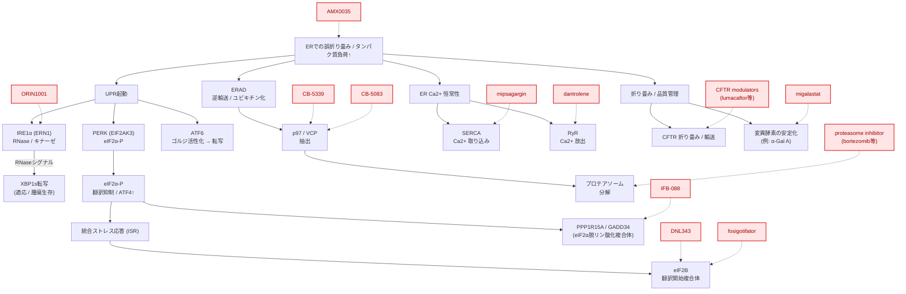

---

## はじめに

<strong>小胞体（ER）</strong>は、分泌タンパク質や膜タンパク質の<strong>折り畳み、品質管理、成熟、細胞内輸送の起点</strong>を担うオルガネラであり、あわせて<strong>脂質合成</strong>や<strong>細胞内 Ca2+ 貯蔵・放出</strong>の場としても機能します。これらの機能が破綻すると、小胞体内に誤って折り畳まれたタンパク質が蓄積し、<strong>小胞体ストレス（ER stress）</strong>が生じます。細胞はこれに対して <strong>UPR（unfolded protein response）</strong> を起動し、翻訳抑制、シャペロン誘導、ER関連分解（ERAD）などを通じて恒常性回復を試みますが、ストレスが強すぎたり遷延したりすると、細胞機能障害や細胞死につながります。[^1][^2][^3]

<strong>小胞体（ER）標的薬</strong>で現時点で臨床実装が進んでいるのは、主に (1) <strong>小胞体での折り畳み・成熟・輸送を補正する薬</strong>、(2) <strong>小胞体内で変異タンパク質を安定化する薬理学的シャペロン（pharmacological chaperone）</strong>、(3) <strong>ERADの下流にあるユビキチン–プロテアソーム系を利用して、分泌負荷の高い腫瘍のタンパク質恒常性（proteostasis）の脆弱性を突く薬</strong>、(4) <strong>ER/SR の Ca2+ 恒常性を調節する薬</strong>の4群です。UPR・統合ストレス応答（ISR）を直接調節する薬は、2026年3月時点ではなお臨床開発段階のものが中心です。[^1][^2][^3]

本記事では、<strong>ERそのものを一次標的とする薬</strong>に加えて、<strong>ERタンパク質恒常性ネットワークの脆弱性を治療に利用する承認薬</strong>も含めて整理しています。そのため、たとえば<strong>プロテアソーム阻害薬</strong>は厳密にはER膜タンパク質を直接阻害する薬ではありませんが、<strong>ERADの出口側を塞ぐことで異常折り畳みタンパク質の蓄積とUPR負荷を増大させる</strong>という意味で、ER関連薬として扱っています。[^1][^4][^5]

<!-- 用語解説：UPR -->

  

    
      <strong>専門用語解説：UPR</strong>
      詳しく見る ▼
    
  

  

<strong>UPR（Unfolded Protein Response、小胞体ストレス応答）</strong>は、小胞体内に<strong>異常折り畳みタンパク質</strong>が蓄積したときに起動するストレス応答です。主なセンサーは <strong>IRE1</strong>、<strong>PERK</strong>、<strong>ATF6</strong> の3つで、翻訳抑制、分子シャペロンの誘導、ERAD の活性化などを通じて、小胞体の処理能力を回復させようとします。

重要なのは、UPR が単なる有害な経路ではなく、まずは<strong>適応応答</strong>として働く点です。一方で、ストレスが強すぎたり長引いたりすると、UPR は<strong>細胞死誘導</strong>の方向へ傾きます。この二面性のため、ER標的医薬ではUPR を完全に遮断するよりも、<strong>どの分岐経路をどの程度調節するか</strong>が重要な設計課題になります。
  

<!-- 用語解説：Proteostasis -->

  

    
      <strong>専門用語解説：タンパク質恒常性（Proteostasis）</strong>
      詳しく見る ▼
    
  

  

<strong>タンパク質恒常性（proteostasis）</strong>とは、細胞内でタンパク質の<strong>合成・折り畳み・輸送・分解</strong>を全体として制御する仕組みを指します。小胞体は分泌タンパク質や膜タンパク質の折り畳み・品質管理の中心であるため、このネットワークの中核的なオルガネラの一つです。

ER標的医薬の文脈では、タンパク質を正しく折り畳ませて救う戦略もあれば、逆にタンパク質恒常性の脆弱性を突いて細胞を破綻させる戦略もあります。たとえば <strong>CFTR補正薬（CFTR corrector）</strong>や<strong>薬理学的シャペロン</strong>は前者、<strong>プロテアソーム阻害薬</strong>は後者に近い考え方です。つまりタンパク質恒常性は、ER創薬を理解するうえでの最も基盤となる概念の一つです。
  

---

## 承認済み小胞体標的薬

初回承認の年の順番に並べています。最終更新日時点での情報を元にまとめています。個別症例の適用可否は各国の承認条件・年齢制限等をご確認ください。

| 疾患/適応 | 販売名［一般名］ | 作用形式 | 会社 | 初回承認（地域） | 投与 | メモ |
|---|---|---|---|---:|---|---|
| 悪性高熱症、高リスク患者での予防／痙縮 | Dantrium / Ryanodex［dantrolene］ | ER/SR カルシウム恒常性調節薬 | Endo / Eagle など | 1974（米）[^6] | 経口 / 静注 | <strong>RyR1 を介する SR からの Ca2+ 放出を抑制</strong>する代表薬。悪性高熱症では救命薬として定着。[^6][^7] |
| 多発性骨髄腫 | VELCADE［bortezomib］ | ERAD下流を利用するタンパク質恒常性攪乱薬 | Millennium / Takeda | 2003（米）[^8] | 静注 / 皮下 | <strong>プロテアソーム阻害薬</strong>。分泌負荷の高い形質細胞系腫瘍のタンパク質恒常性の脆弱性を突く。[^4][^8] |
| 再発・難治性多発性骨髄腫 | KYPROLIS［carfilzomib］ | ERAD下流を利用するタンパク質恒常性攪乱薬 | Onyx / Amgen | 2012（米）[^9] | 静注 | 第二世代プロテアソーム阻害薬。[^9] |
| Cystic fibrosis（F508del/F508del） | ORKAMBI［lumacaftor/ivacaftor］ | 小胞体での折り畳み・輸送補正薬 | Vertex | 2015（米）[^10] | 経口 | <strong>lumacaftor は CFTR補正薬（corrector）</strong>として F508del-CFTR の小胞体滞留を減らし、細胞表面発現を増やす。ivacaftor は増強薬（potentiator）。[^10][^11] |
| 多発性骨髄腫 | NINLARO［ixazomib］ | ERAD下流を利用するタンパク質恒常性攪乱薬 | Takeda | 2015（米）[^12] | 経口 | 初の経口プロテアソーム阻害薬。[^12] |
| Fabry disease（対応変異保有例） | Galafold［migalastat］ | 薬理学的シャペロン（pharmacological chaperone） | Amicus | 2016（EU）[^13] | 経口 | <strong>対応変異型（amenable mutation） α-ガラクトシダーゼA を小胞体内で安定化</strong>し、リソソームへの輸送を促す。[^13][^14] |
| Cystic fibrosis（F508del/F508del ほか） | SYMDEKO / SYMKEVI［tezacaftor/ivacaftor］ | 小胞体での折り畳み・輸送補正薬 | Vertex | 2018（米 / EU）[^15][^16] | 経口 | <strong>tezacaftor は補正薬（corrector）</strong>、ivacaftor は増強薬（potentiator）。lumacaftor/ivacaftor より薬物相互作用の面で扱いやすい症例がある。[^15][^16] |
| Cystic fibrosis（少なくとも1つの F508del など） | TRIKAFTA / KAFTRIO［elexacaftor/tezacaftor/ivacaftor］ | 小胞体での折り畳み・輸送補正薬 | Vertex | 2019（米）[^17] | 経口 | <strong>2つの補正薬（elexacaftor, tezacaftor）＋ 増強薬（ivacaftor）</strong>からなる三剤併用。現行のCFTR機能回復治療の中心。[^17][^18][^19] |

> 注：<strong>ivacaftor 単剤（KALYDECO）</strong>も承認済みCFTR調節薬ですが、主作用は細胞表面に到達したCFTRの<strong>チャネル開口特性の改善</strong>であり、小胞体での折り畳み・輸送補正を主軸とする本記事の表からは外しています。[^20]

---

## 対象疾患

現在の承認薬を俯瞰すると、ER関連治療薬の対象疾患は大きく3つの臨床文脈に分かれます。

### 1. 折り畳み異常や輸送障害を伴う遺伝性疾患

代表例は<strong>嚢胞性線維症（Cystic fibrosis）</strong>と<strong>ファブリー病（Fabry disease）</strong>です。前者ではF508del-CFTRの小胞体滞留が、後者では対応変異型（amenable mutation）<strong>α-ガラクトシダーゼA</strong>の不安定化が問題となり、いずれも<strong>小胞体の品質管理を通過できる形にタンパク質を修正する</strong>ことが治療の核になります。[^10][^11][^13][^14]

### 2. 分泌負荷の高い血液系悪性腫瘍

形質細胞系腫瘍である<strong>多発性骨髄腫（multiple myeloma）</strong>は大量の免疫グロブリン産生に依存しており、小胞体のタンパク質恒常性とUPRに強く依存します。このため<strong>プロテアソーム阻害薬</strong>は、ERADの出口側を塞ぐことでタンパク質毒性ストレスを増幅し、治療効果を示します。[^4][^5][^8][^9][^12]

### 3. ER/SR カルシウム放出の破綻が急性病態に直結する疾患

代表例が<strong>悪性高熱症</strong>です。悪性高熱症は、主に<strong>RYR1遺伝子変異</strong>により骨格筋の<strong>筋小胞体（SR）におけるCa2+放出チャネルが過剰に活性化</strong>されることで発症します。揮発性麻酔薬や脱分極性筋弛緩薬を契機に、RyR1が制御不能な開口状態となり、<strong>細胞質Ca2+濃度が持続的に上昇</strong>します。その結果、筋収縮の持続、ATP消費の亢進、代謝熱産生の増大が引き起こされ、<strong>高体温やアシドーシスを伴うハイパーメタボリック状態</strong>に至ります。[^6][^7]

<strong>dantrolene</strong>はこの病態の上流に作用し、<strong>RyR1を介するSRからのCa2+放出を直接抑制</strong>することで、細胞質Ca2+濃度を低下させ、筋収縮および代謝暴走を速やかに抑制します。このため悪性高熱症に対して<strong>病態特異的に救命効果を示す治療薬</strong>として確立しています。[^6][^7]

---

## 小胞体関連治療薬は大きく分類すると4つ

### 1. 小胞体での折り畳み・成熟・輸送の補正

この群は、小胞体内で<strong>折り畳み異常</strong>や<strong>輸送障害</strong>を起こしたタンパク質を、<strong>折り畳み補正・成熟促進・小胞体からの放出促進</strong>によって救う薬です。最も完成度の高い例は<strong>CFTR調節薬（CFTR modulators）</strong>で、<strong>lumacaftor</strong>、<strong>tezacaftor</strong>、<strong>elexacaftor</strong>はいずれも<strong>CFTR補正薬（corrector）</strong>として働き、特に<strong>F508del-CFTR</strong>の小胞体滞留を減らして細胞表面への到達量を増やします。一方で<strong>ivacaftor</strong>は主として細胞表面CFTRのチャネル開口確率を改善する<strong>増強薬（potentiator）</strong>です。したがってORKAMBI、SYMDEKO/SYMKEVI、TRIKAFTA/KAFTRIOは、<strong>小胞体での折り畳み補正を含む複合調節薬</strong>として位置づけるのが正確です。[^10][^11][^15][^16][^17][^18][^19]

<!-- 用語解説：CFTR corrector -->

  

    
      <strong>専門用語解説：CFTR補正薬（CFTR corrector）</strong>
      詳しく見る ▼
    
  

  

<strong>CFTR補正薬（CFTR corrector）</strong>は、嚢胞性線維症の原因となる<strong>CFTRタンパク質の折り畳み異常・輸送障害</strong>を補正し、小胞体から細胞膜への輸送を改善する薬剤群です。特に<strong>F508del-CFTR</strong>は小胞体で正しく成熟できず、品質管理によって分解されやすいため、補正薬はこの小胞体滞留を減らす役割を担います。

代表的な補正薬には<strong>lumacaftor</strong>、<strong>tezacaftor</strong>、<strong>elexacaftor</strong>があり、しばしば<strong>ivacaftor</strong>のような<strong>増強薬（potentiator）</strong>と併用されます。補正薬が細胞膜まで届ける薬であるのに対し、増強薬は膜上に到達したCFTRの機能を高める薬です。この区別は、ER標的医薬としての位置づけを理解するうえで重要です。
  

### 2. 薬理学的シャペロン

この群は、変異タンパク質、特に酵素を<strong>小胞体内で安定化</strong>し、品質管理を通過させて正しい細胞内輸送につなげる薬です。承認薬の代表は<strong>migalastat</strong>で、ファブリー病における<strong>対応変異（amenable mutation）</strong>を持つ<strong>α-ガラクトシダーゼA</strong>に結合して酵素を安定化し、<strong>小胞体からリソソームへの輸送</strong>を促進します。したがってmigalastatは、一般的な化学シャペロン（chemical chaperone）ではなく、<strong>特定の標的タンパク質を選択的に安定化する薬理学的シャペロン（pharmacological chaperone）</strong>とみなすべきです。[^13][^14][^21]

<!-- 用語解説：Pharmacological chaperone -->

  

    
      <strong>専門用語解説：薬理学的シャペロン（Pharmacological chaperone）</strong>
      詳しく見る ▼
    
  

  

<strong>薬理学的シャペロン（pharmacological chaperone）</strong>は、特定の変異タンパク質に結合して<strong>構造を安定化</strong>し、小胞体の品質管理を通過できるようにする低分子化合物です。一般的な分子シャペロン（HSPなど）が細胞にもともと存在するタンパク質群であるのに対し、薬理学的シャペロンは<strong>薬として投与される外因性分子</strong>です。

ER標的医薬の代表例は<strong>migalastat</strong>で、ファブリー病における対応変異型<strong>α-ガラクトシダーゼA</strong>を小胞体内で安定化し、分解されずにリソソームへ運ばれる確率を高めます。この戦略は、タンパク質を補充するのではなく、<strong>患者自身の変異タンパク質を修正してレスキューする</strong>治療といえます。
  

### 3. 小胞体タンパク質恒常性ネットワーク・ERAD下流を利用する薬

承認薬の中心は、ERストレスセンサーである<strong>IRE1/PERK/ATF6 を直接調節する薬</strong>ではなく、<strong>ERADの下流にあるプロテアソーム</strong>を阻害する薬です。代表例は<strong>bortezomib</strong>、<strong>carfilzomib</strong>、<strong>ixazomib</strong>で、直接標的はプロテアソームですが、小胞体で生じた異常折り畳みタンパク質の分解出口を塞ぐことで<strong>タンパク質毒性ストレス</strong>を増幅し、特に<strong>形質細胞系腫瘍</strong>において有効性を示します。厳密にはER標的薬というより、<strong>小胞体タンパク質恒常性の脆弱性を利用する薬</strong>と呼ぶ方が正確です。[^1][^4][^5][^8][^9][^12]

<!-- 用語解説：ERAD -->

  

    
      <strong>専門用語解説：ERAD</strong>
      詳しく見る ▼
    
  

  

<strong>ERAD（ER-associated degradation、小胞体関連分解）</strong>は、小胞体で正しく折り畳めなかったタンパク質を認識し、<strong>細胞質側への逆輸送（retrotranslocation）</strong>を経てユビキチン化し、最終的に<strong>プロテアソーム</strong>で分解する品質管理機構です。小胞体の不良品処理ラインと考えると理解しやすいです。

この経路では<strong>p97/VCP</strong>が、基質を膜から引き抜くAAAファミリーATPaseとして重要な役割を担います。ER標的医薬の観点では、ERADを直接操作する薬はまだ限られますが、<strong>プロテアソーム阻害薬</strong>や<strong>p97阻害薬</strong>はこの経路の下流・中核に介入することで、異常折り畳みタンパク質の蓄積を増やし、特にタンパク質恒常性に強く依存する腫瘍細胞にダメージを与えます。
  

### 4. ER/SR カルシウム恒常性調節薬

この群は<strong>ER/SRのCa2+恒常性</strong>を介して作用します。承認薬の代表は<strong>dantrolene</strong>で、悪性高熱症の背景にある<strong>RyR1</strong>を介する過剰なSRからのCa2+放出を抑制します。これに対し、<strong>SERCA</strong>を標的とする薬は創薬研究上は魅力的ですが、2026年3月時点でSERCA直接阻害薬の承認例は主要には存在せず、<strong>mipsagargin</strong>は臨床試験まで進んだものの未承認です。[^6][^7][^22][^23]

---

## ER経路マップと薬剤の作用点

ER stress 創薬の全体像をざっくり俯瞰すると、<strong>UPR（IRE1/PERK/ATF6）</strong>、<strong>統合ストレス応答（ISR）（eIF2α–eIF2B–PPP1R15A）</strong>、<strong>ERAD–p97/VCP–プロテアソーム系</strong>、<strong>ER/SR Ca2+ 恒常性（SERCA/RyR）</strong>、および<strong>折り畳み・品質管理</strong>が主要な介入点になります。承認薬が存在するのは主として<strong>CFTR機能回復薬</strong>、<strong>migalastat</strong>、<strong>プロテアソーム阻害薬</strong>、<strong>dantrolene</strong>の領域であり、<strong>IRE1/eIF2B/PPP1R15A/p97/SERCA</strong>の標的薬は依然として開発品中心です。[^1][^2][^3][^4][^22][^24][^25][^26][^27]

※ 図中の点線矢印は、各薬剤が作用する標的分子または経路を示しています。
<!-- 用語解説：ISR -->

  

    
      <strong>専門用語解説：ISR（統合ストレス応答）</strong>
      詳しく見る ▼
    
  

  

<strong>ISR（Integrated Stress Response、統合ストレス応答）</strong>は、ER stress だけでなく、アミノ酸飢餓、ウイルス感染、酸化ストレスなど複数のストレス入力を統合して、<strong>eIF2αのリン酸化</strong>を介して翻訳を制御する応答です。ER由来のストレスでは主に<strong>PERK</strong>がこの系に入ります。

eIF2αがリン酸化されると全般的な翻訳は抑制されますが、一部のストレス応答遺伝子はむしろ翻訳されやすくなります。ここで重要になるのが<strong>eIF2B</strong>と<strong>PPP1R15A/GADD34</strong>で、前者は翻訳再開側、後者はeIF2α脱リン酸化側に関わります。ER標的医薬では、ISRを完全に遮断するのではなく、<strong>eIF2B活性化薬（activator）</strong>などで翻訳を適度に回復させる部分調節が有力な戦略になっています。
  

## 開発中の治療薬

直接的な<strong>UPR/ISR/ERAD/ER Ca2+</strong>を狙う創薬は、いまも主として<strong>臨床試験段階</strong>にあります。2026年3月時点で公表情報から分かるものを下表に示します。なお、試験が完了（completed）で結果待ち・次段階未公表のものも含めています。[^24][^25][^26][^27][^28][^29]

| 薬剤 | 主な標的/経路 | 主な対象 | 最新の公表段階 | メモ |
|---|---|---|---|---|
| ORIN1001 | <strong>IRE1α RNase阻害薬</strong> | 進行固形がん | Phase 1/2 完了[^24] | IRE1–XBP1経路を直接狙う代表的臨床例。[^24] |
| DNL343 | <strong>eIF2B活性化薬</strong> | ALS | HEALEY Regimen G 完了[^25] | ISRを完全遮断せず<strong>翻訳回復</strong>の方向に調節する設計。[^1][^25] |
| fosigotifator（ABBV-CLS-7262） | <strong>eIF2B活性化薬</strong> | ALS、VWMなど | ALS試験完了、VWMで臨床継続/拡大アクセス[^26][^27] | ISR調節の臨床開発で存在感が大きい。[^26][^27] |
| IFB-088 / icerguastat | <strong>PPP1R15A/eIF2α脱リン酸化系の調節薬</strong> | 球麻痺型ALSなど | Phase 2 完了[^28] | ISRを延長・調整するタイプの候補。[^1][^28] |
| CB-5339 | <strong>p97/VCP阻害薬</strong> | AML/MDS、固形腫瘍 | 一部試験で臨床開発中止/不透明[^29][^30] | p97はERADの中核AAAファミリーATPase。[^4][^29] |
| mipsagargin（G-202） | <strong>SERCA阻害薬プロドラッグ</strong> | 固形がん、肝細胞がん、膠芽腫 | Phase 2 まで[^22][^23][^31] | PSMA発現腫瘍血管で活性化される設計。[^22][^23] |
| AMX0035（PB + taurursodiol） | <strong>ER・ミトコンドリア起点の細胞死経路抑制</strong> | ALS、PSP、Wolfram症候群など | ALS承認後に市場撤退、他適応は一部開発継続/中止混在[^32][^33] | 4-PBAを含むため、広義のERストレス緩和薬としてしばしば議論される。[^1][^32][^33] |

### コラム：ALSを対象としたER標的治療薬

<strong>筋萎縮性側索硬化症（ALS; amyotrophic lateral sclerosis）</strong>は、進行性に運動ニューロンが変性・脱落する致死性疾患であり、現在も有効な治療選択肢が限られる<strong>アンメットメディカルニーズの代表例</strong>です。私自身も、祖母が長年ALSに苦しめられていたため、この疾患には個人的な思い入れがあります。

ALSの病態は単一ではなく、<strong>TDP-43などの異常タンパク質凝集</strong>、<strong>SOD1変異に伴うタンパク質ミスフォールディング</strong>、RNA代謝異常、ミトコンドリア機能障害、軸索輸送障害などが重なり合う<strong>多因子性神経変性疾患</strong>と理解されています。これらに共通する特徴の一つが、<strong>タンパク質恒常性（proteostasis）の破綻</strong>であり、とくに小胞体における折り畳み負荷の増大や、<strong>UPR/ISRの持続的活性化</strong>が重要な病態要素として注目されています。[^1][^2][^3]

ALSでER標的治療薬が多く開発されている理由は、ER stress/ISRが複数の病態の<strong>収束点</strong>に位置するためです。タンパク質ミスフォールディング、翻訳ストレス、ミトコンドリア障害など、異なる細胞内ストレスが最終的に<strong>PERK–eIF2α–eIF2B</strong>を含む統合ストレス応答へ流れ込むため、この経路を調節することで神経細胞の生存を支えられる可能性があります。[^1][^25][^26]

現在開発中の<strong>DNL343</strong>や<strong>fosigotifator（ABBV-CLS-7262）</strong>は、いずれも<strong>eIF2B活性化薬</strong>として設計されており、ISRを完全に遮断するのではなく、慢性的なストレス下で低下した翻訳を<strong>適度に回復させる</strong>方向に作用します。また、<strong>IFB-088/icerguastat</strong>は、PPP1R15A/eIF2α脱リン酸化系に関わる候補薬として、ISRの強さや持続時間を調節する戦略に位置づけられます。[^25][^26][^28]

一方で、ALSにおけるER stress緩和戦略の難しさを示した例が<strong>AMX0035（PB + taurursodiol）</strong>です。AMX0035は、4-PBAによるER stress緩和とtaurursodiolによるミトコンドリア起点の細胞死経路抑制を組み合わせたレジメンとして開発され、初期試験では機能低下の進行抑制が報告されました。しかし、確認試験で有効性を再現できず、2024年にALS適応で市場撤退となりました。[^32][^33]

この経緯は、<strong>ER stressを抑えるという考え方自体が否定された</strong>というよりも、どの患者群で、どの経路を、どの程度調節するべきかを見極めることの難しさを示しています。ALSにおけるER標的創薬は、単なるストレス遮断ではなく、<strong>タンパク質恒常性ネットワークをどのように再平衡化するか</strong>を問う領域になりつつあります。

ALSでの成功はまだ限定的ですが、ER/ISR制御の最適化が進めば、ALSにとどまらず、より広い神経変性疾患への応用が期待されます。実際、これまで治療が困難とされてきた疾患においても、タンパク質恒常性や小胞体ストレスといった病態プロセスの理解に基づく創薬が進みつつあり、疾患の根本機序に介入する新しい治療戦略として現実味を帯びてきています。

その意味でALSは、ER標的医薬の将来像である「精密なproteostasis調節」が臨床的にどのような価値を持ちうるかを示す、重要な先行領域の一つと位置づけられます。

## 開発中止例

以下の表は、ERを治療標的として開発された薬の中で臨床試験で開発中止となった事例をまとめています。
臨床まで進んで中止になった事例は、実際にはUPR/ISR直接標的薬よりも、<strong>p97/VCP</strong>や<strong>SERCA</strong>、あるいは<strong>ERストレス緩和レジメン</strong>で目立ちます。なお、<strong>PERK阻害薬</strong>の代表的化合物である<strong>GSK2606414/GSK2656157</strong>は創薬上重要ですが、臨床試験での中止例というより<strong>前臨床段階での毒性・選択性の問題</strong>として理解したほうがよいです。[^1][^34][^35][^36]

> <strong>レジメン（regimen）</strong> は、単一の有効成分そのものではなく、<strong>複数成分の組み合わせや投与設計を含めた治療法の枠組み</strong>を指します。この記事では、たとえば <strong>AMX0035</strong> のように、複数の成分を組み合わせて ER stress 関連経路に介入する治療を指して使用しています。

| 薬剤 | 主な標的/位置づけ | 臨床段階 | 主な対象 | 中止/撤退の理由 | 補足 |
|---|---|---|---|---|---|
| CB-5083 | <strong>p97/VCP阻害薬</strong> | Phase 1[^31] | 進行固形がん | 視覚関連有害事象で中止。後に<strong>PDE6への非標的作用（off-target効果）</strong>が示唆。[^31][^34] | ERADを狙う発想自体は鋭いが、標的選択性が課題。 |
| CB-5339 | <strong>p97/VCP阻害薬</strong> | Phase 1 準備/実施段階[^29] | 固形がん・リンパ腫ほか | ClinicalTrials.gov では "clinical development of the agent has been discontinued" と記載された withdrawn trial あり。[^29] | 権利移管などはあるが、少なくとも一部グローバル開発は停止。[^30] |
| mipsagargin（G-202） | <strong>SERCA阻害薬プロドラッグ</strong> | Phase 2[^22][^23][^31] | 肝細胞がん、膠芽腫など | 腎毒性・点滴関連毒性が課題で、明確な承認経路に至らず公的開発は停滞。[^22][^23][^37] | 選択的SERCA創薬の難しさを示す代表例。 |
| AMX0035（RELYVRIO / ALBRIOZA） | <strong>ERストレス関連細胞死抑制レジメン</strong> | 承認後・Phase 3[^32][^33] | ALS | PHOENIX試験結果を受けて2024年に市場撤退。[^33] | 「承認後の確認試験で有効性が示せず撤退」の例。 |
| AMX0035（ORIONプログラム） | 同上 | Phase 2b/3 計画[^38] | PSP | 主要・副次評価項目でプラセボとの差がみられず、2025年にプログラム中止。[^38] | ERストレス緩和仮説の適応依存性を示す。 |

> 注：<strong>PERK阻害薬</strong>は本記事の表には入れていません。理由は、代表薬がヒトで大規模臨床中止に至ったというより、<strong>膵毒性</strong>や<strong>RIPK1への非標的作用</strong>などの問題が前臨床・トランスレーショナル段階で強く認識され、臨床展開が進まなかったケースだからです。[^1][^35][^36]

## 小胞体標的薬の開発が難しい理由

### 1. ER経路は病因であると同時に生理的防御機構でもある

ERストレスとUPRは、単純な有害な経路ではありません。<strong>IRE1/PERK/ATF6</strong>はまず<strong>適応応答</strong>として働き、翻訳抑制、分子シャペロン誘導、ERAD促進などを通じてタンパク質恒常性を回復させます。そのため、病態によっては抑制が有利でも、別の状況では<strong>正常組織の適応能</strong>まで奪ってしまいます。これはER創薬が一般的ながん遺伝子阻害よりも難しい理由の一つです。[^1][^2][^3]

### 2. 正常組織への依存性が高く、標的起因毒性（on-target toxicity）が出やすい

ER機能はとくに<strong>分泌細胞</strong>や高代謝細胞で重要です。PERK阻害では、前臨床段階で<strong>膵毒性</strong>が大きな障害として認識されました。PERKは分泌細胞の生存に必須であり、経路を強く抑えすぎると治療標的以外の正常組織が先に破綻しやすい、というのが典型例です。[^1][^35]

### 3. 完全阻害ではなく部分調節が必要で、治療域設計が難しい

ERストレス/ISRは、しばしば<strong>完全阻害</strong>よりも<strong>部分調節</strong>が望まれます。実際、ISRを遮断するのではなく、<strong>eIF2B活性化</strong>により翻訳を適度に回復させる戦略が臨床で追われています。つまりER創薬では、標的に効くかどうかだけでなく、<strong>どの程度効かせるか</strong>が薬効と毒性を分けます。[^1][^25][^26]

### 4. バイオマーカー・患者選別・真の標的選択性が不足しやすい

ERストレスは多くの疾患で観察されますが、患者ごとに<strong>どのUPR経路にどの程度依存しているか</strong>を定量的に見るのは容易ではありません。また、化合物の標的選択性も問題です。たとえば<strong>CB-5083</strong>では視覚毒性の背景に<strong>PDE6への非標的作用</strong>が示され、<strong>GSK2606414/GSK2656157</strong>では<strong>RIPK1阻害作用</strong>が報告されました。ER創薬では、標的妥当性だけでなく、<strong>化合物プローブ・開発候補化合物の標的選択性</strong>がとりわけ重要です。[^34][^36]

## まとめ

小胞体を起点とする病態の本質は、<strong>誤って折り畳まれたタンパク質が蓄積し、凝集や機能喪失を通じて細胞毒性をもたらす</strong>点にあります。この分子機構の理解は過去20年で大きく進展し、その成果はすでに臨床に還元されており、<strong>CFTR補正薬や薬理学的シャペロン</strong>のように、<strong>タンパク質を正しく折り畳ませて機能を回復させる治療</strong>は実臨床で重要な位置を占めています。[^10][^13][^17]

同時に、<strong>UPR（小胞体ストレス応答）</strong>は、代謝ストレス（特に脂肪毒性）、がん、神経変性疾患など、さまざまな疾患における細胞応答の中核として機能することが明らかになってきました。とくに<strong>多発性骨髄腫</strong>に代表される血液腫瘍領域では、<strong>プロテアソーム阻害薬による小胞体ストレスの増幅</strong>がすでに標準治療として確立しており、<strong>ERストレスの操作そのものが治療原理として成立している</strong>点は重要です。[^4][^8]

一方で、小胞体標的創薬が難しい理由も明確になりつつあります。第一に、UPRは<strong>細胞を守る適応応答であると同時に、過剰になると細胞死を引き起こす</strong>という二面性を持つため、単純に抑えればよい経路ではありません。第二に、小胞体機能は正常細胞、特に分泌細胞にとって不可欠であり、<strong>標的そのものを狙った作用がそのまま副作用につながりやすい</strong>という問題があります。さらに、ERストレス応答は<strong>完全に止めるのではなく適度に調整する必要がある</strong>ため、薬の効かせ方（強さや持続時間）の設計が極めて難しく、加えて<strong>どの患者でどの経路が効いているかを見分ける指標（バイオマーカー）が十分でない</strong>ことも開発の障壁となっています。[^1][^2][^3]

したがって、今後の小胞体標的薬は、単純な「ストレスを止める薬」ではなく、<strong>疾患ごとのコンテキストに応じてタンパク質恒常性（proteostasis）を精密に調整する医薬</strong>へと発展していく可能性が高いと考えられます。ER創薬はすでに一部の領域で成功例を持ちながら、なお拡張余地の大きい分野であり、<strong>基礎的なオルガネラ生物学と臨床薬理を接続する代表的な創薬領域の一つ</strong>として、今後の展開が注目されます。[^1][^2][^3][^4]

## 出典
[^1]: Marciniak SJ, Chambers JE, Ron D. Pharmacological targeting of endoplasmic reticulum stress in disease. Nat Rev Drug Discov. 2022;21(2):115-140. doi:10.1038/s41573-021-00320-3. https://www.nature.com/articles/s41573-021-00320-3
[^2]: Hetz C, Zhang K, Kaufman RJ. Mechanisms, regulation and functions of the unfolded protein response. Nat Rev Mol Cell Biol. 2020;21(8):421-438. doi:10.1038/s41580-020-0250-z. https://pubmed.ncbi.nlm.nih.gov/32341392/
[^3]: Acosta-Alvear D, Harnoss JM, Walter P, Ashkenazi A. Homeostasis control in health and disease by the unfolded protein response. Nat Rev Mol Cell Biol. 2025. doi:10.1038/s41580-024-00794-0. https://www.nature.com/articles/s41580-024-00794-0
[^4]: Christianson JC, Jarosch E, Sommer T. Mechanisms of substrate processing during ER-associated protein degradation. Nat Rev Mol Cell Biol. 2023;24(11):777-796. doi:10.1038/s41580-023-00633-8. https://www.nature.com/articles/s41580-023-00633-8
[^5]: Lee AH, Iwakoshi NN, Anderson KC, Glimcher LH. Proteasome inhibitors disrupt the unfolded protein response in myeloma cells. Proc Natl Acad Sci U S A. 2003;100(17):9946-9951. doi:10.1073/pnas.1334037100. https://pubmed.ncbi.nlm.nih.gov/12902539/
[^6]: RYANODEX® (dantrolene sodium) for injectable suspension, for intravenous use. Full Prescribing Information. Initial U.S. Approval: 1974. DailyMed / FDA label. https://dailymed.nlm.nih.gov/dailymed/drugInfo.cfm?setid=8f7b3ac0-604d-4c78-b545-5e0f8ea3d698
[^7]: Zhao F, Li P, Chen SRW, Louis CF, Fruen BR. Dantrolene inhibition of ryanodine receptor Ca2+ release channels. Molecular mechanism and isoform selectivity. J Biol Chem. 2001;276(17):13810-13816. doi:10.1074/jbc.M006104200. https://pubmed.ncbi.nlm.nih.gov/11278295/
[^8]: FDA Orphan Drug database / VELCADE information. Bortezomib (VELCADE) marketing approval date: 2003-05-13. https://www.accessdata.fda.gov/scripts/opdlisting/oopd/detailedIndex.cfm?cfgridkey=163002 ; https://www.fda.gov/drugs/postmarket-drug-safety-information-patients-and-providers/velcade-bortezomib-information
[^9]: FDA Drug Approval Package: Kyprolis (carfilzomib) approval date 2012-07-20; Prescribing information states “Kyprolis is a proteasome inhibitor.” https://www.accessdata.fda.gov/drugsatfda_docs/nda/2012/202714Orig1s000TOC.cfm ; https://www.accessdata.fda.gov/drugsatfda_docs/label/2022/202714s034lbl.pdf
[^10]: FDA Orphan Drug database / ORKAMBI label. Orkambi approval date 2015-07-02; lumacaftor/ivacaftor indicated for CF patients with F508del mutations. https://www.accessdata.fda.gov/scripts/opdlisting/oopd/detailedIndex.cfm?cfgridkey=434814 ; https://www.accessdata.fda.gov/drugsatfda_docs/label/2018/206038s010lbl.pdf
[^11]: Wainwright CE, Elborn JS, Ramsey BW, et al. Lumacaftor-Ivacaftor in Patients with Cystic Fibrosis Homozygous for Phe508del CFTR. N Engl J Med. 2015;373:220-231. doi:10.1056/NEJMoa1409547. https://pubmed.ncbi.nlm.nih.gov/25981758/
[^12]: FDA Orphan Drug database / Drug Trials Snapshot. NINLARO (ixazomib) marketing approval date 2015-11-20. https://www.accessdata.fda.gov/scripts/opdlisting/oopd/detailedIndex.cfm?cfgridkey=330510 ; https://www.fda.gov/drugs/drug-approvals-and-databases/drug-trials-snapshots-ninlaro
[^13]: European Medicines Agency. Galafold (migalastat) EPAR. Marketing authorisation issued 26 May 2016; migalastat stabilises certain unstable forms of alpha-galactosidase A and allows transport within the cell. https://www.ema.europa.eu/en/medicines/human/EPAR/galafold
[^14]: Feldt-Rasmussen U, Hughes D, Sunder-Plassmann G, et al. Oral pharmacological chaperone migalastat compared with enzyme replacement therapy in Fabry disease: 18-month results from the randomised phase III ATTRACT study. J Med Genet. 2017;54(4):288-296. doi:10.1136/jmedgenet-2016-104178. https://pubmed.ncbi.nlm.nih.gov/27834756/
[^15]: FDA / Drugs@FDA. SYMDEKO (tezacaftor/ivacaftor and ivacaftor) approval 2018. https://www.fda.gov/drugs/drug-approvals-and-databases/drug-trials-snapshots-symdeko ; https://www.accessdata.fda.gov/drugsatfda_docs/label/2018/210491lbl.pdf
[^16]: European Medicines Agency. Symkevi EPAR. Tezacaftor increases the number of CFTR proteins on the cell; ivacaftor increases their activity. https://www.ema.europa.eu/en/medicines/human/EPAR/symkevi
[^17]: FDA Orphan Drug database / Drug Trials Snapshot. TRIKAFTA approval date 2019-10-21. https://www.accessdata.fda.gov/scripts/opdlisting/oopd/detailedIndex.cfm?cfgridkey=647618 ; https://www.fda.gov/drugs/drug-approvals-and-databases/drug-trials-snapshots-trikafta
[^18]: Middleton PG, Mall MA, Dřevínek P, et al. Elexacaftor-Tezacaftor-Ivacaftor for Cystic Fibrosis with a Single Phe508del Allele. N Engl J Med. 2019;381(19):1809-1819. doi:10.1056/NEJMoa1908639. https://pubmed.ncbi.nlm.nih.gov/31697873/
[^19]: European Medicines Agency. Kaftrio EPAR. Elexacaftor and tezacaftor increase the number of CFTR proteins on the cell surface; ivacaftor improves activity of the defective protein. https://www.ema.europa.eu/en/medicines/human/EPAR/kaftrio
[^20]: FDA / Drugs@FDA. KALYDECO (ivacaftor) approval 2012; CFTR potentiator. https://www.fda.gov/drugs/drug-approvals-and-databases/drug-trials-snapshots-kalydeco ; https://www.accessdata.fda.gov/drugsatfda_docs/label/2023/203188s038lbl.pdf
[^21]: McCafferty EH, Scott LJ. Migalastat: A Review in Fabry Disease. Drugs. 2019;79(5):543-554. doi:10.1007/s40265-019-01090-4. https://pubmed.ncbi.nlm.nih.gov/30875019/
[^22]: Mahalingam D, Peguero J, Cen P, et al. A phase II study of mipsagargin in patients with advanced hepatocellular carcinoma. Br J Cancer. 2019;122:25-31. doi:10.1038/s41416-019-0639-z. https://www.nature.com/articles/s41416-019-0639-z
[^23]: Denmeade SR, Mhaka AM, Rosen DM, et al. Engineering a prostate-specific membrane antigen-activated tumor endothelial cell prodrug for cancer therapy. Sci Transl Med. 2012;4(140):140ra86. doi:10.1126/scitranslmed.3003886. https://pubmed.ncbi.nlm.nih.gov/22745334/
[^24]: ClinicalTrials.gov. NCT05154201 ORIN1001 monotherapy and combination in advanced solid malignant tumors. Last update posted 2025-05-30. https://clinicaltrials.gov/study/NCT05154201
[^25]: ClinicalTrials.gov. NCT05842941 HEALEY ALS Platform Trial - Regimen G DNL343. Results first posted 2026-01-28. https://clinicaltrials.gov/study/NCT05842941
[^26]: ClinicalTrials.gov. NCT05740813 HEALEY ALS Platform Trial - Regimen F ABBV-CLS-7262. https://clinicaltrials.gov/study/NCT05740813
[^27]: ClinicalTrials.gov. NCT05757141 Fosigotifator in Vanishing White Matter Disease and NCT06594016 Expanded Access to Fosigotifator. https://clinicaltrials.gov/study/NCT05757141 ; https://clinicaltrials.gov/study/NCT06594016
[^28]: ClinicalTrials.gov. NCT05508074 IFB-088 plus riluzole in bulbar-onset ALS. Completed; other names include icerguastat. https://clinicaltrials.gov/study/NCT05508074
[^29]: ClinicalTrials.gov. NCT04372641 p97 inhibitor CB-5339 in advanced solid tumors and lymphomas. Withdrawn; “clinical development of the agent has been discontinued.” https://clinicaltrials.gov/study/NCT04372641
[^30]: CASI Pharmaceuticals annual filing / SEC. CB-5339 rights transfer and development history. https://www.sec.gov/Archives/edgar/data/1962738/000155837025004086/casi-20241231x20f.htm
[^31]: ClinicalTrials.gov. NCT02243917 CB-5083 in advanced solid tumors. https://clinicaltrials.gov/study/NCT02243917
[^32]: ClinicalTrials.gov. NCT03127514 CENTAUR trial of AMX0035 in ALS. Detailed description notes blockade of key cellular death pathways originating in the mitochondria and ER. https://clinicaltrials.gov/study/NCT03127514
[^33]: Amylyx Pharmaceuticals. Formal intention to remove RELYVRIO/ALBRIOZA from the market after PHOENIX Phase 3 topline results (2024-04-04). https://investors.amylyx.com/news-releases/news-release-details/amylyx-pharmaceuticals-announces-formal-intention-remove
[^34]: Leinonen H, et al. A p97/Valosin-Containing Protein Inhibitor Drug CB-5083 Has a Potent but Reversible Off-Target Effect on Phosphodiesterase-6. J Pharmacol Exp Ther. 2021;378(1):32-45. doi:10.1124/jpet.121.000509. https://pubmed.ncbi.nlm.nih.gov/33931547/
[^35]: Yu Q, Zhao B, Gui J, et al. Type I interferons mediate pancreatic toxicities of PERK inhibition. Proc Natl Acad Sci U S A. 2015;112(50):15420-15425. doi:10.1073/pnas.1516362112. https://pubmed.ncbi.nlm.nih.gov/26627716/
[^36]: Rojas-Rivera D, Delvaeye T, Roelandt R, et al. When PERK inhibitors turn out to be new potent RIPK1 inhibitors: critical issues on the specificity and use of GSK2606414 and GSK2656157. Cell Death Differ. 2017;24(6):1100-1110. doi:10.1038/cdd.2017.58. https://pubmed.ncbi.nlm.nih.gov/28452996/
[^37]: ClinicalTrials.gov. NCT02067156 mipsagargin in recurrent/progressive glioblastoma. https://clinicaltrials.gov/study/NCT02067156
[^38]: Amylyx Pharmaceuticals. Discontinue ORION program of AMX0035 for PSP after no difference on primary/secondary outcomes (2025-08-27). https://investors.amylyx.com/news-releases/news-release-details/amylyx-pharmaceuticals-discontinue-orion-program-amx0035
