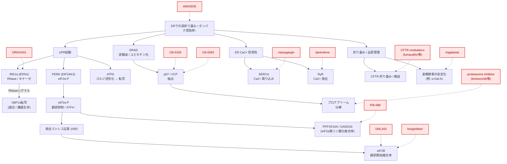

## 概要

<strong>小胞体（ER）標的薬</strong>で現時点で臨床実装が進んでいるのは、主に (1) <strong>小胞体での折り畳み・成熟・輸送を補正する薬</strong>、(2) <strong>小胞体内で変異タンパク質を安定化する薬理学的シャペロン（pharmacological chaperone）</strong>、(3) <strong>ERADの下流にあるユビキチン–プロテアソーム系を利用して、分泌負荷の高い腫瘍のタンパク質恒常性（proteostasis）の脆弱性を突く薬</strong>、(4) <strong>ER/SR の Ca2+ 恒常性を調節する薬</strong>の4群です。UPR・統合ストレス応答（ISR）を直接調節する薬は、2026年3月時点ではなお臨床開発段階のものが中心です。[^1][^2][^3]

本記事では、<strong>ERそのものを一次標的とする薬</strong>に加えて、<strong>ERタンパク質恒常性ネットワークの脆弱性を治療に利用する承認薬</strong>も含めて整理しています。そのため、たとえば<strong>プロテアソーム阻害薬</strong>は厳密にはER膜タンパク質を直接阻害する薬ではありませんが、<strong>ERADの出口側を塞ぐことで異常折り畳みタンパク質の蓄積とUPR負荷を増大させる</strong>という意味で、ER関連薬として扱っています。[^1][^4][^5]

<!-- 用語解説：UPR -->

  

    
      <strong>専門用語解説：UPR</strong>
      詳しく見る ▼
    
  

  

<strong>UPR（Unfolded Protein Response、小胞体ストレス応答）</strong>は、小胞体内に<strong>異常折り畳みタンパク質</strong>が蓄積したときに起動するストレス応答です。主なセンサーは <strong>IRE1</strong>、<strong>PERK</strong>、<strong>ATF6</strong> の3つで、翻訳抑制、分子シャペロンの誘導、ERAD の活性化などを通じて、小胞体の処理能力を回復させようとします。

重要なのは、UPR が単なる「有害な経路」ではなく、まずは<strong>適応応答</strong>として働く点です。一方で、ストレスが強すぎたり長引いたりすると、UPR は<strong>細胞死誘導</strong>の方向へ傾きます。この二面性のため、ER標的医薬では「UPR を完全に遮断する」よりも、<strong>どの分岐経路をどの程度調節するか</strong>が重要な設計課題になります。
  

<!-- 用語解説：Proteostasis -->

  

    
      <strong>専門用語解説：タンパク質恒常性（Proteostasis）</strong>
      詳しく見る ▼
    
  

  

<strong>タンパク質恒常性（proteostasis）</strong>とは、細胞内でタンパク質の<strong>合成・折り畳み・輸送・分解</strong>を全体として制御する仕組みを指します。小胞体は分泌タンパク質や膜タンパク質の折り畳み・品質管理の中心であるため、このネットワークの中核的なオルガネラの一つです。

ER標的医薬の文脈では、「タンパク質を正しく折り畳ませて救う」戦略もあれば、「逆にタンパク質恒常性の脆弱性を突いて細胞を破綻させる」戦略もあります。たとえば <strong>CFTR補正薬（CFTR corrector）</strong>や<strong>薬理学的シャペロン</strong>は前者、<strong>プロテアソーム阻害薬</strong>は後者に近い考え方です。つまりタンパク質恒常性は、ER創薬を理解するうえでの最も基盤となる概念の一つです。
  

---

## 承認済み小胞体標的薬

初回承認の年の順番に並べています。最終更新日時点での情報を元にまとめています。個別症例の適用可否は各国の承認条件・年齢制限等をご確認ください。

| 疾患/適応 | 販売名［一般名］ | 作用形式 | 会社 | 初回承認（地域） | 投与 | メモ |
|---|---|---|---|---:|---|---|
| 悪性高熱症、高リスク患者での予防／痙縮 | Dantrium / Ryanodex［dantrolene］ | ER/SR calcium homeostasis modulator | Endo / Eagle など | 1974（米）[^6] | 経口 / 静注 | <strong>RyR1 を介する SR からの Ca2+ 放出を抑制</strong>する代表薬。悪性高熱症では救命薬として定着。[^6][^7] |
| 多発性骨髄腫 | VELCADE［bortezomib］ | ER proteostasis / ERAD downstream exploitation | Millennium / Takeda | 2003（米）[^8] | 静注 / 皮下 | <strong>proteasome inhibitor</strong>。分泌負荷の高い plasma cell malignancy で proteostasis 脆弱性を突く。[^4][^8] |
| 再発・難治性多発性骨髄腫 | KYPROLIS［carfilzomib］ | ER proteostasis / ERAD downstream exploitation | Onyx / Amgen | 2012（米）[^9] | 静注 | 第二世代 proteasome inhibitor。[^9] |
| Cystic fibrosis（F508del/F508del） | ORKAMBI［lumacaftor/ivacaftor］ | ER folding / trafficking corrector | Vertex | 2015（米）[^10] | 経口 | <strong>lumacaftor は CFTR corrector</strong>として F508del-CFTR の ER 滞留を減らし、細胞表面発現を増やす。ivacaftor は potentiator。[^10][^11] |
| 多発性骨髄腫 | NINLARO［ixazomib］ | ER proteostasis / ERAD downstream exploitation | Takeda | 2015（米）[^12] | 経口 | 初の経口 proteasome inhibitor。[^12] |
| Fabry disease（amenable mutation） | Galafold［migalastat］ | Pharmacological chaperone | Amicus | 2016（EU）[^13] | 経口 | <strong>amenable 変異型 α-Gal A を ER 内で安定化</strong>し、lysosome への輸送を促す。[^13][^14] |
| Cystic fibrosis（F508del/F508del ほか） | SYMDEKO / SYMKEVI［tezacaftor/ivacaftor］ | ER folding / trafficking corrector | Vertex | 2018（米 / EU）[^15][^16] | 経口 | <strong>tezacaftor は corrector</strong>、ivacaftor は potentiator。lumacaftor/ivacaftor より相互作用面で扱いやすい症例がある。[^15][^16] |
| Cystic fibrosis（少なくとも1つの F508del など） | TRIKAFTA / KAFTRIO［elexacaftor/tezacaftor/ivacaftor］ | ER folding / trafficking corrector | Vertex | 2019（米）[^17] | 経口 | <strong>2つの corrector（elexacaftor, tezacaftor）＋ potentiator（ivacaftor）</strong>からなる triple combination。現行の CFTR rescue の中心。[^17][^18][^19] |

> 注：<strong>ivacaftor 単剤（KALYDECO）</strong>も承認済み CFTR modulator ですが、主作用は細胞表面に到達した CFTR の <strong>channel gating 改善</strong>であり、ER folding / trafficking rescue を主軸とする本記事の「代表的な ER folding corrector」表からは外しています。[^20]

---

## 対象疾患

現在の承認薬を俯瞰すると、ER関連治療薬の対象疾患は大きく3つの臨床文脈に分かれます。第一に、<strong>misfolding や trafficking defect を伴う遺伝性疾患</strong>で、代表例は <strong>Cystic fibrosis</strong> と <strong>Fabry disease</strong> です。前者では F508del-CFTR の ER 滞留が、後者では amenable 変異型 <strong>α-Gal A</strong> の不安定化が問題となり、いずれも <strong>ER quality control を通過できる形に rescue する</strong>ことが治療の核になります。[^10][^11][^13][^14]

第二に、<strong>分泌負荷の高い hematologic malignancy</strong> です。形質細胞系腫瘍である <strong>multiple myeloma</strong> は大量の免疫グロブリン産生に依存しており、ER proteostasis と UPR に強く依存します。このため <strong>proteasome inhibitors</strong> は、ERAD の出口側を塞ぐことで proteotoxic stress を増幅し、治療効果を示します。[^4][^5][^8][^9][^12]

第三に、<strong>ER/SR calcium release の破綻が急性病態に直結する疾患</strong>で、代表例が <strong>malignant hyperthermia</strong> です。ここでは <strong>dantrolene</strong> が skeletal muscle の <strong>RyR1-mediated Ca2+ release</strong> を抑えることで救命的に働きます。[^6][^7]

---

## 小胞体関連治療薬は大きく分類すると4つ

### 1. ERでの折り畳み・成熟・輸送の補正

この群は、ER内で <strong>misfolding</strong> や <strong>trafficking defect</strong> を起こしたタンパク質を、<strong>folding 補正・成熟促進・ER exit 改善</strong>によって救う薬です。最も完成度の高い例は <strong>CFTR modulators</strong> で、<strong>lumacaftor</strong>、<strong>tezacaftor</strong>、<strong>elexacaftor</strong> はいずれも <strong>CFTR corrector</strong> として働き、特に <strong>F508del-CFTR</strong> の ER 滞留を減らして細胞表面への到達量を増やします。一方で <strong>ivacaftor</strong> は主として細胞表面 CFTR の開口確率を改善する <strong>potentiator</strong> です。したがって ORKAMBI、SYMDEKO/SYMKEVI、TRIKAFTA/KAFTRIO は、<strong>「ER rescue を含む複合モジュレーター」</strong>として位置づけるのが正確です。[^10][^11][^15][^16][^17][^18][^19]

<!-- 用語解説：CFTR corrector -->

  

    
      <strong>専門用語解説：CFTR corrector</strong>
      詳しく見る ▼
    
  

  

<strong>CFTR corrector</strong> は、Cystic fibrosis の原因となる <strong>CFTR タンパク質の folding defect / trafficking defect</strong> を補正し、ER から細胞膜への輸送を改善する薬剤群です。特に <strong>F508del-CFTR</strong> は小胞体で正しく成熟できず、品質管理によって分解されやすいため、corrector はこの ER 滞留を減らす役割を担います。

代表的な corrector には <strong>lumacaftor</strong>、<strong>tezacaftor</strong>、<strong>elexacaftor</strong> があり、しばしば <strong>ivacaftor</strong> のような <strong>potentiator</strong> と併用されます。corrector が「細胞膜まで届ける」薬であるのに対し、potentiator は「膜上に到達した CFTR の機能を高める」薬です。この区別は、ERターゲット医薬としての位置づけを理解するうえで重要です。
  

### 2. Pharmacological chaperone

この群は、変異タンパク質、特に酵素を <strong>ER 内で安定化</strong>し、品質管理を通過させて正しい細胞内輸送につなげる薬です。承認薬の代表は <strong>migalastat</strong> で、Fabry disease における <strong>amenable mutation</strong> を持つ <strong>α-galactosidase A</strong> に結合して酵素を安定化し、<strong>ER から lysosome への trafficking</strong> を促進します。したがって migalastat は、一般的な「chemical chaperone」ではなく、<strong>特定クライアントを選択的に安定化する pharmacological chaperone</strong> とみなすべきです。[^13][^14][^21]

<!-- 用語解説：Pharmacological chaperone -->

  

    
      <strong>専門用語解説：Pharmacological chaperone</strong>
      詳しく見る ▼
    
  

  

<strong>Pharmacological chaperone</strong> は、特定の変異タンパク質に結合して<strong>構造を安定化</strong>し、ER の品質管理を通過できるようにする低分子化合物です。一般的な分子シャペロン（HSP など）が細胞にもともと存在するタンパク質群であるのに対し、pharmacological chaperone は<strong>薬として投与される外因性分子</strong>です。

ERターゲット医薬の代表例は <strong>migalastat</strong> で、Fabry disease における amenable 変異型 <strong>α-Gal A</strong> を ER 内で安定化し、分解されずに lysosome へ運ばれる確率を高めます。したがってこの戦略は、タンパク質を「補充する」のではなく、<strong>患者自身の変異タンパク質を rescue する</strong>治療といえます。
  

### 3. ER proteostasis network / ERAD downstream を利用する薬

この分類は少し注意が必要です。承認薬の中心は、<strong>IRE1/PERK/ATF6 を直接調節する薬</strong>ではなく、<strong>ERAD の下流にある proteasome</strong> を阻害する薬です。代表例は <strong>bortezomib</strong>、<strong>carfilzomib</strong>、<strong>ixazomib</strong> で、直接標的は proteasome ですが、ER で生じた misfolded protein の分解出口を塞ぐことで <strong>proteotoxic stress</strong> を増幅し、特に <strong>plasma cell malignancy</strong> において有効性を示します。厳密には “ER-targeted” というより、<strong>ER-proteostasis vulnerability exploiting drugs</strong> と呼ぶ方が正確です。[^1][^4][^5][^8][^9][^12]

<!-- 用語解説：ERAD -->

  

    
      <strong>専門用語解説：ERAD</strong>
      詳しく見る ▼
    
  

  

<strong>ERAD（ER-associated degradation）</strong> は、小胞体で正しく折り畳めなかったタンパク質を認識し、<strong>細胞質側へ逆輸送（retrotranslocation）</strong>したうえで、ユビキチン化し、最終的に <strong>proteasome</strong> で分解する品質管理機構です。小胞体の「不良品処理ライン」と考えると理解しやすいです。

この経路では <strong>p97 / VCP</strong> が、基質を膜から引き抜く AAA+ ATPase として重要な役割を担います。ERターゲット医薬の観点では、ERAD 自体を直接操作する薬はまだ限られますが、<strong>proteasome inhibitor</strong> や <strong>p97 inhibitor</strong> はこの経路の下流・中核に介入することで、misfolded protein burden を増やし、特に proteostasis に強く依存する腫瘍細胞にダメージを与えます。
  

### 4. ER / SR calcium homeostasis modulators

この群は <strong>ER/SR の Ca2+ 恒常性</strong>を介して作用します。承認薬の代表は <strong>dantrolene</strong> で、悪性高熱症の背景にある <strong>RyR1</strong> を介する過剰な SR からの Ca2+ 放出を抑制します。これに対し、<strong>SERCA</strong> を標的とする薬は創薬研究上は魅力的ですが、2026年3月時点で <strong>SERCA 直接阻害薬の承認例は主要には存在せず</strong>、<strong>mipsagargin</strong> は臨床試験まで進んだものの未承認です。[^6][^7][^22][^23]

---

## ER経路マップと薬剤の作用点

ER stress 創薬の全体像をざっくり俯瞰すると、<strong>UPR（IRE1 / PERK / ATF6）</strong>、<strong>ISR（eIF2α–eIF2B–PPP1R15A）</strong>、<strong>ERAD–p97/VCP–proteasome</strong>、<strong>ER/SR Ca2+ 恒常性（SERCA / RyR）</strong>、および <strong>folding / quality control</strong> が主要な介入点になります。承認薬が存在するのは主として <strong>CFTR rescue</strong>、<strong>migalastat</strong>、<strong>proteasome inhibitors</strong>、<strong>dantrolene</strong> の領域であり、<strong>IRE1 / eIF2B / PPP1R15A / p97 / SERCA</strong> は依然として開発品中心です。[^1][^2][^3][^4][^22][^24][^25][^26][^27]

※ 図中の点線矢印は、各薬剤が作用する標的分子または経路を示しています。

<!-- 用語解説：ISR -->

  

    
      <strong>専門用語解説：ISR</strong>
      詳しく見る ▼
    
  

  

<strong>ISR（Integrated Stress Response）</strong> は、ER stress だけでなく、アミノ酸飢餓、ウイルス感染、酸化ストレスなど複数のストレス入力を統合して、<strong>eIF2α のリン酸化</strong>を介して翻訳を制御する応答です。ER 由来の stress では主に <strong>PERK</strong> がこの系に入ります。

eIF2α がリン酸化されると全般的な翻訳は抑制されますが、一部の stress response 遺伝子はむしろ翻訳されやすくなります。ここで重要になるのが <strong>eIF2B</strong> と <strong>PPP1R15A / GADD34</strong> で、前者は翻訳再開側、後者は eIF2α 脱リン酸化側に関わります。ERターゲット医薬では、ISR を完全に遮断するのではなく、<strong>eIF2B activator</strong> などで翻訳を適度に回復させる「部分調節」が有力な戦略になっています。
  

## 開発中の治療薬

直接的な <strong>UPR / ISR / ERAD / ER Ca2+</strong> を狙う創薬は、いまも主として <strong>臨床試験段階</strong> にあります。2026年3月時点で公表情報を追いやすいものを下表に示します。なお、試験が <strong>completed</strong> で結果待ち・次段階未公表のものも含めています。[^24][^25][^26][^27][^28][^29]

| 薬剤 | 主な標的/経路 | 主な対象 | 最新の公表段階 | メモ |
|---|---|---|---|---|
| ORIN1001 | <strong>IRE1α RNase inhibitor</strong> | 進行固形がん | Phase 1/2 完了[^24] | IRE1–XBP1 axis を直接狙う代表的臨床例。[^24] |
| DNL343 | <strong>eIF2B activator</strong> | ALS | HEALEY Regimen G 完了[^25] | ISR を完全遮断ではなく <strong>translation recovery</strong> の方向に調節する設計。[^1][^25] |
| fosigotifator（ABBV-CLS-7262） | <strong>eIF2B activator</strong> | ALS, VWM など | ALS 試験完了、VWM で臨床継続/expanded access[^26][^27] | ISR modulation の臨床開発で存在感が大きい。[^26][^27] |
| IFB-088 / icerguastat | <strong>PPP1R15A / eIF2α dephosphorylation 系の調節</strong> | bulbar-onset ALS など | Phase 2 完了[^28] | ISR を延長・調整するタイプの候補。[^1][^28] |
| CB-5339 | <strong>p97/VCP inhibitor</strong> | AML/MDS, 固形腫瘍 | 一部試験で臨床開発中止/不透明[^29][^30] | p97 は ERAD の中核 AAA-ATPase。[^4][^29] |
| mipsagargin（G-202） | <strong>SERCA inhibitor prodrug</strong> | 固形がん、HCC、GBM | Phase 2 まで[^22][^23][^31] | PSMA 発現腫瘍血管で活性化する設計。[^22][^23] |
| AMX0035（PB + taurursodiol） | <strong>ER/mitochondria 起点の細胞死経路抑制</strong> | ALS, PSP, Wolfram syndrome など | ALS 承認後に市場撤退、他適応は一部開発継続/中止混在[^32][^33] | 4-PBA を含むため、広義の ER stress 緩和薬としてしばしば議論される。[^1][^32][^33] |

## 開発中止例

<strong>「小胞体をターゲットにする」</strong>といっても、臨床まで進んで中止になった事例は、実際には <strong>UPR/ISR 直撃薬</strong>よりも、<strong>p97/VCP</strong> や <strong>SERCA</strong>、あるいは <strong>ER stress 緩和レジメン</strong> で目立ちます。なお、<strong>PERK inhibitors</strong> の代表的化合物である <strong>GSK2606414 / GSK2656157</strong> は創薬上重要ですが、臨床試験での中止例というより <strong>前臨床段階での毒性・選択性の問題</strong>として理解するのが正確です。[^1][^34][^35][^36]

| 薬剤 | 主な標的/位置づけ | 臨床段階 | 主な対象 | 中止/撤退の理由 | 補足 |
|---|---|---|---|---|---|
| CB-5083 | <strong>p97/VCP inhibitor</strong> | Phase 1[^31] | 進行固形がん | 視覚関連有害事象で中止。のちに <strong>PDE6 off-target</strong> が示唆。[^31][^34] | ERAD を狙う発想自体は鋭いが、標的特異性が課題。 |
| CB-5339 | <strong>p97/VCP inhibitor</strong> | Phase 1 準備/実施段階[^29] | 固形がん・リンパ腫ほか | ClinicalTrials.gov では “clinical development of the agent has been discontinued” と記載された withdrawn trial あり。[^29] | 権利移管などはあるが、少なくとも一部グローバル開発は停止。[^30] |
| mipsagargin（G-202） | <strong>SERCA inhibitor prodrug</strong> | Phase 2[^22][^23][^31] | HCC, GBM など | 腎毒性・infusion-related toxicity が課題で、明確な承認経路に至らず公的開発は停滞。[^22][^23][^37] | 「選択的 SERCA 創薬の難しさ」を示す代表例。 |
| AMX0035（RELYVRIO / ALBRIOZA） | <strong>ER stress 関連細胞死抑制レジメン</strong> | 承認後・Phase 3[^32][^33] | ALS | PHOENIX 試験結果を受けて 2024年に市場撤退。[^33] | 「承認後に confirmatory failure で撤退」の例。 |
| AMX0035（ORION program） | 同上 | Phase 2b/3 計画[^38] | PSP | 主要・副次評価項目で placebo 差がみられず、2025年に program discontinued。[^38] | ER stress 緩和仮説の適応依存性を示す。 |

> 注：<strong>PERK inhibitors</strong> は本記事の「開発中止表」には入れていません。理由は、代表薬がヒトで大規模臨床中止に至ったというより、<strong>膵毒性</strong>や<strong>RIPK1 off-target</strong>などの問題が前臨床・トランスレーショナル段階で強く認識され、臨床展開が進まなかったケースだからです。[^1][^35][^36]

## 小胞体標的薬の開発が難しい理由

### 1. ER 経路は病因であると同時に生理的防御機構でもある

ER stress と UPR は、単純な「悪い経路」ではありません。<strong>IRE1 / PERK / ATF6</strong> はまず <strong>適応応答</strong>として働き、翻訳抑制、chaperone 誘導、ERAD 促進などを通じて proteostasis を回復させます。そのため、病態によっては抑制が有利でも、別の状況では <strong>正常組織の適応能</strong>まで奪ってしまいます。これは ER 創薬が一般的な oncogene inhibition よりも難しい理由の一つです。[^1][^2][^3]

### 2. 正常組織依存性が高く、on-target toxicity が出やすい

ER 機能はとくに <strong>分泌細胞</strong>や高代謝細胞で重要です。PERK 阻害では、前臨床段階で <strong>膵毒性</strong>が大きな障害として認識されました。PERK は secretory cell の生存に必須であり、経路を強く抑えすぎると治療標的以外の正常組織が先に破綻しやすい、というのが典型例です。[^1][^35]

### 3. 完全阻害ではなく部分調節が必要で、治療域設計が難しい

ER stress / ISR は、しばしば <strong>完全阻害</strong>よりも <strong>部分調節</strong>が望まれます。実際、ISR を “off” にするのではなく、<strong>eIF2B activation</strong> により翻訳を適度に回復させる戦略が臨床で追われています。つまり ER 創薬では、標的に効くかどうかだけでなく、<strong>どの程度効かせるか</strong> が薬効と毒性を分けます。[^1][^25][^26]

### 4. バイオマーカー・患者選別・真の標的特異性が不足しやすい

ER stress は多くの疾患で観察されますが、患者ごとに <strong>どの UPR arm にどの程度依存しているか</strong> を定量的に見るのは容易ではありません。また、化合物の標的特異性も問題です。たとえば <strong>CB-5083</strong> では視覚毒性の背景に <strong>PDE6 off-target</strong> が示され、<strong>GSK2606414 / GSK2656157</strong> では <strong>RIPK1 inhibition</strong> が報告されました。ER 創薬では、標的妥当性だけでなく、<strong>chemical probe / clinical candidate の selectivity</strong> がとりわけ重要です。[^34][^36]

## まとめ

小胞体関連の承認薬はすでに存在しますが、その中心は UPR sensor を直接たたく薬ではなく、(1) CFTR の folding / trafficking rescue、(2) migalastat のような pharmacological chaperone、(3) proteasome inhibitors による ER proteostasis vulnerability exploitation、(4) dantrolene による ER/SR calcium modulation です。[^1][^6][^8][^10][^13][^17]
一方、IRE1 / PERK–eIF2α / eIF2B / PPP1R15A / p97 / SERCA を狙う創薬は現在も活発ですが、生理的防御反応と病的応答の二面性、on-target toxicity、部分調節の必要性、バイオマーカー不足のため、開発難易度は高いままです。したがって ER 標的薬の将来像は、単なる “stress blocker” よりも、疾患コンテキストに応じた精密な proteostasis tuning に向かう可能性が高いと考えられます。[^1][^2][^3][^4]

## 出典
[^1]: Marciniak SJ, Chambers JE, Ron D. Pharmacological targeting of endoplasmic reticulum stress in disease. Nat Rev Drug Discov. 2022;21(2):115-140. doi:10.1038/s41573-021-00320-3. https://www.nature.com/articles/s41573-021-00320-3
[^2]: Hetz C, Zhang K, Kaufman RJ. Mechanisms, regulation and functions of the unfolded protein response. Nat Rev Mol Cell Biol. 2020;21(8):421-438. doi:10.1038/s41580-020-0250-z. https://pubmed.ncbi.nlm.nih.gov/32341392/
[^3]: Acosta-Alvear D, Harnoss JM, Walter P, Ashkenazi A. Homeostasis control in health and disease by the unfolded protein response. Nat Rev Mol Cell Biol. 2025. doi:10.1038/s41580-024-00794-0. https://www.nature.com/articles/s41580-024-00794-0
[^4]: Christianson JC, Jarosch E, Sommer T. Mechanisms of substrate processing during ER-associated protein degradation. Nat Rev Mol Cell Biol. 2023;24(11):777-796. doi:10.1038/s41580-023-00633-8. https://www.nature.com/articles/s41580-023-00633-8
[^5]: Lee AH, Iwakoshi NN, Anderson KC, Glimcher LH. Proteasome inhibitors disrupt the unfolded protein response in myeloma cells. Proc Natl Acad Sci U S A. 2003;100(17):9946-9951. doi:10.1073/pnas.1334037100. https://pubmed.ncbi.nlm.nih.gov/12902539/
[^6]: RYANODEX® (dantrolene sodium) for injectable suspension, for intravenous use. Full Prescribing Information. Initial U.S. Approval: 1974. DailyMed / FDA label. https://dailymed.nlm.nih.gov/dailymed/drugInfo.cfm?setid=8f7b3ac0-604d-4c78-b545-5e0f8ea3d698
[^7]: Zhao F, Li P, Chen SRW, Louis CF, Fruen BR. Dantrolene inhibition of ryanodine receptor Ca2+ release channels. Molecular mechanism and isoform selectivity. J Biol Chem. 2001;276(17):13810-13816. doi:10.1074/jbc.M006104200. https://pubmed.ncbi.nlm.nih.gov/11278295/
[^8]: FDA Orphan Drug database / VELCADE information. Bortezomib (VELCADE) marketing approval date: 2003-05-13. https://www.accessdata.fda.gov/scripts/opdlisting/oopd/detailedIndex.cfm?cfgridkey=163002 ; https://www.fda.gov/drugs/postmarket-drug-safety-information-patients-and-providers/velcade-bortezomib-information
[^9]: FDA Drug Approval Package: Kyprolis (carfilzomib) approval date 2012-07-20; Prescribing information states “Kyprolis is a proteasome inhibitor.” https://www.accessdata.fda.gov/drugsatfda_docs/nda/2012/202714Orig1s000TOC.cfm ; https://www.accessdata.fda.gov/drugsatfda_docs/label/2022/202714s034lbl.pdf
[^10]: FDA Orphan Drug database / ORKAMBI label. Orkambi approval date 2015-07-02; lumacaftor/ivacaftor indicated for CF patients with F508del mutations. https://www.accessdata.fda.gov/scripts/opdlisting/oopd/detailedIndex.cfm?cfgridkey=434814 ; https://www.accessdata.fda.gov/drugsatfda_docs/label/2018/206038s010lbl.pdf
[^11]: Wainwright CE, Elborn JS, Ramsey BW, et al. Lumacaftor-Ivacaftor in Patients with Cystic Fibrosis Homozygous for Phe508del CFTR. N Engl J Med. 2015;373:220-231. doi:10.1056/NEJMoa1409547. https://pubmed.ncbi.nlm.nih.gov/25981758/
[^12]: FDA Orphan Drug database / Drug Trials Snapshot. NINLARO (ixazomib) marketing approval date 2015-11-20. https://www.accessdata.fda.gov/scripts/opdlisting/oopd/detailedIndex.cfm?cfgridkey=330510 ; https://www.fda.gov/drugs/drug-approvals-and-databases/drug-trials-snapshots-ninlaro
[^13]: European Medicines Agency. Galafold (migalastat) EPAR. Marketing authorisation issued 26 May 2016; migalastat stabilises certain unstable forms of alpha-galactosidase A and allows transport within the cell. https://www.ema.europa.eu/en/medicines/human/EPAR/galafold
[^14]: Feldt-Rasmussen U, Hughes D, Sunder-Plassmann G, et al. Oral pharmacological chaperone migalastat compared with enzyme replacement therapy in Fabry disease: 18-month results from the randomised phase III ATTRACT study. J Med Genet. 2017;54(4):288-296. doi:10.1136/jmedgenet-2016-104178. https://pubmed.ncbi.nlm.nih.gov/27834756/
[^15]: FDA / Drugs@FDA. SYMDEKO (tezacaftor/ivacaftor and ivacaftor) approval 2018. https://www.fda.gov/drugs/drug-approvals-and-databases/drug-trials-snapshots-symdeko ; https://www.accessdata.fda.gov/drugsatfda_docs/label/2018/210491lbl.pdf
[^16]: European Medicines Agency. Symkevi EPAR. Tezacaftor increases the number of CFTR proteins on the cell; ivacaftor increases their activity. https://www.ema.europa.eu/en/medicines/human/EPAR/symkevi
[^17]: FDA Orphan Drug database / Drug Trials Snapshot. TRIKAFTA approval date 2019-10-21. https://www.accessdata.fda.gov/scripts/opdlisting/oopd/detailedIndex.cfm?cfgridkey=647618 ; https://www.fda.gov/drugs/drug-approvals-and-databases/drug-trials-snapshots-trikafta
[^18]: Middleton PG, Mall MA, Dřevínek P, et al. Elexacaftor-Tezacaftor-Ivacaftor for Cystic Fibrosis with a Single Phe508del Allele. N Engl J Med. 2019;381(19):1809-1819. doi:10.1056/NEJMoa1908639. https://pubmed.ncbi.nlm.nih.gov/31697873/
[^19]: European Medicines Agency. Kaftrio EPAR. Elexacaftor and tezacaftor increase the number of CFTR proteins on the cell surface; ivacaftor improves activity of the defective protein. https://www.ema.europa.eu/en/medicines/human/EPAR/kaftrio
[^20]: FDA / Drugs@FDA. KALYDECO (ivacaftor) approval 2012; CFTR potentiator. https://www.fda.gov/drugs/drug-approvals-and-databases/drug-trials-snapshots-kalydeco ; https://www.accessdata.fda.gov/drugsatfda_docs/label/2023/203188s038lbl.pdf
[^21]: McCafferty EH, Scott LJ. Migalastat: A Review in Fabry Disease. Drugs. 2019;79(5):543-554. doi:10.1007/s40265-019-01090-4. https://pubmed.ncbi.nlm.nih.gov/30875019/
[^22]: Mahalingam D, Peguero J, Cen P, et al. A phase II study of mipsagargin in patients with advanced hepatocellular carcinoma. Br J Cancer. 2019;122:25-31. doi:10.1038/s41416-019-0639-z. https://www.nature.com/articles/s41416-019-0639-z
[^23]: Denmeade SR, Mhaka AM, Rosen DM, et al. Engineering a prostate-specific membrane antigen-activated tumor endothelial cell prodrug for cancer therapy. Sci Transl Med. 2012;4(140):140ra86. doi:10.1126/scitranslmed.3003886. https://pubmed.ncbi.nlm.nih.gov/22745334/
[^24]: ClinicalTrials.gov. NCT05154201 ORIN1001 monotherapy and combination in advanced solid malignant tumors. Last update posted 2025-05-30. https://clinicaltrials.gov/study/NCT05154201
[^25]: ClinicalTrials.gov. NCT05842941 HEALEY ALS Platform Trial - Regimen G DNL343. Results first posted 2026-01-28. https://clinicaltrials.gov/study/NCT05842941
[^26]: ClinicalTrials.gov. NCT05740813 HEALEY ALS Platform Trial - Regimen F ABBV-CLS-7262. https://clinicaltrials.gov/study/NCT05740813
[^27]: ClinicalTrials.gov. NCT05757141 Fosigotifator in Vanishing White Matter Disease and NCT06594016 Expanded Access to Fosigotifator. https://clinicaltrials.gov/study/NCT05757141 ; https://clinicaltrials.gov/study/NCT06594016
[^28]: ClinicalTrials.gov. NCT05508074 IFB-088 plus riluzole in bulbar-onset ALS. Completed; other names include icerguastat. https://clinicaltrials.gov/study/NCT05508074
[^29]: ClinicalTrials.gov. NCT04372641 p97 inhibitor CB-5339 in advanced solid tumors and lymphomas. Withdrawn; “clinical development of the agent has been discontinued.” https://clinicaltrials.gov/study/NCT04372641
[^30]: CASI Pharmaceuticals annual filing / SEC. CB-5339 rights transfer and development history. https://www.sec.gov/Archives/edgar/data/1962738/000155837025004086/casi-20241231x20f.htm
[^31]: ClinicalTrials.gov. NCT02243917 CB-5083 in advanced solid tumors. https://clinicaltrials.gov/study/NCT02243917
[^32]: ClinicalTrials.gov. NCT03127514 CENTAUR trial of AMX0035 in ALS. Detailed description notes blockade of key cellular death pathways originating in the mitochondria and ER. https://clinicaltrials.gov/study/NCT03127514
[^33]: Amylyx Pharmaceuticals. Formal intention to remove RELYVRIO/ALBRIOZA from the market after PHOENIX Phase 3 topline results (2024-04-04). https://investors.amylyx.com/news-releases/news-release-details/amylyx-pharmaceuticals-announces-formal-intention-remove
[^34]: Leinonen H, et al. A p97/Valosin-Containing Protein Inhibitor Drug CB-5083 Has a Potent but Reversible Off-Target Effect on Phosphodiesterase-6. J Pharmacol Exp Ther. 2021;378(1):32-45. doi:10.1124/jpet.121.000509. https://pubmed.ncbi.nlm.nih.gov/33931547/
[^35]: Yu Q, Zhao B, Gui J, et al. Type I interferons mediate pancreatic toxicities of PERK inhibition. Proc Natl Acad Sci U S A. 2015;112(50):15420-15425. doi:10.1073/pnas.1516362112. https://pubmed.ncbi.nlm.nih.gov/26627716/
[^36]: Rojas-Rivera D, Delvaeye T, Roelandt R, et al. When PERK inhibitors turn out to be new potent RIPK1 inhibitors: critical issues on the specificity and use of GSK2606414 and GSK2656157. Cell Death Differ. 2017;24(6):1100-1110. doi:10.1038/cdd.2017.58. https://pubmed.ncbi.nlm.nih.gov/28452996/
[^37]: ClinicalTrials.gov. NCT02067156 mipsagargin in recurrent/progressive glioblastoma. https://clinicaltrials.gov/study/NCT02067156
[^38]: Amylyx Pharmaceuticals. Discontinue ORION program of AMX0035 for PSP after no difference on primary/secondary outcomes (2025-08-27). https://investors.amylyx.com/news-releases/news-release-details/amylyx-pharmaceuticals-discontinue-orion-program-amx0035
